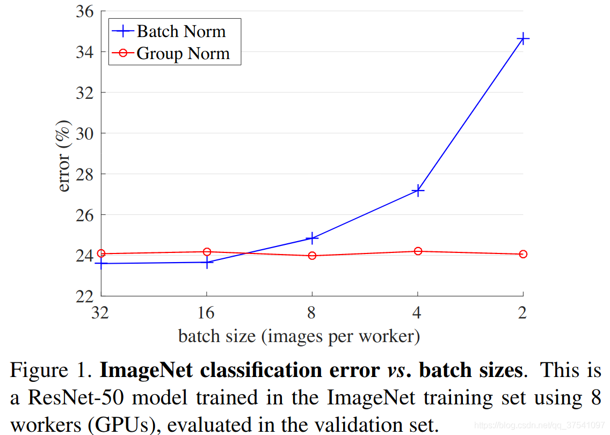
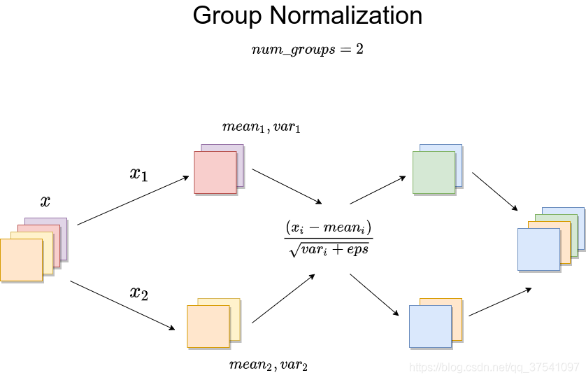

https://blog.csdn.net/qq_37541097/article/details/118016048

论文名称：Group Normalization
论文地址：https://arxiv.org/abs/1803.08494

在之前的文章中有介绍过BN(Batch Normalization)，[链接](https://blog.csdn.net/qq_37541097/article/details/104434557)，以及LN(Layer Normalization)，[链接](https://blog.csdn.net/qq_37541097/article/details/117653177)。今天来简单聊聊GN(Group Normalization)。在视觉领域，其实最常用的还是BN，但BN也有缺点，通常需要比较大的Batch Size。如下图所示，蓝色的线代表BN，当batch size小于16后error明显升高（但大于16后的效果确实要更好）。对于比较大型的网络或者GPU显存不够的情况下，通常无法设置较大的batch size，此时可以使用GN。如下图所示，batch size的大小对GN并没有影响，所以当batch size设置较小时，可以采用GN。



无论是BN、LN还是GN，公式都是一样的，都是减均值 $E(x)$ ，除以标准差 $\sqrt{Var(x) + \epsilon }$其中 $\epsilon$ 是一个非常小的量（默认 $10^{-5}$）是为了防止分母为零。以及两个可训练的参数 $\beta, \gamma$。不同在于是在哪个/哪些维度上进行操作：
$$
y = \frac {x - E(x)} {\sqrt {Var(x) + \epsilon}} * \gamma + \beta
$$
对于GN(Group Normalization)的操作如下图所示，假设 $num\_groups=2$ 论文中默认为32，由于和batch_size无关，我们直接看对于一个样本的情况。假设某层输出得到 $x$，根据 $num\_groups$ 沿 $ channel$ 方向均分成 $num\_groups$ 份，后对每一份求均值和方差，接着按照上面的公式进行计算即可，非常简单。



为了验证自己理解的是否正确，下面使用Pytorch做个简单的实验，创建一个随机变量，分别使用官方的GN方法和自己实现的GN方法做对比，看结果是否一样。

```python
import torch
import torch.nn as nn


def group_norm(x: torch.Tensor,
               num_groups: int,
               num_channels: int,
               eps: float = 1e-5,
               gamma: float = 1.0,
               beta: float = 0.):
    assert divmod(num_channels, num_groups)[1] == 0
    channels_per_group = num_channels // num_groups

    new_tensor = []
    for t in x.split(channels_per_group, dim=1):
        var_mean = torch.var_mean(t, dim=[1, 2, 3], unbiased=False)
        var = var_mean[0]
        mean = var_mean[1]
        t = (t - mean[:, None, None, None]) / torch.sqrt(var[:, None, None, None] + eps)
        t = t * gamma + beta
        new_tensor.append(t)

    new_tensor = torch.cat(new_tensor, dim=1)
    return new_tensor


def main():
    num_groups = 2
    num_channels = 4
    eps = 1e-5

    img = torch.rand(2, num_channels, 2, 2)
    print(img)

    gn = nn.GroupNorm(num_groups=num_groups, num_channels=num_channels, eps=eps)
    r1 = gn(img)
    print(r1)

    r2 = group_norm(img, num_groups, num_channels, eps)
    print(r2)


if __name__ == '__main__':
    main()
```

对比官方和自己实现的方法，下图左边是通过官方GN方法得到的结果，右边是通过自己实现GN方法得到的结果。


很明显和官方得到的结果是一模一样的，这也说明了自己的理解是正确的。