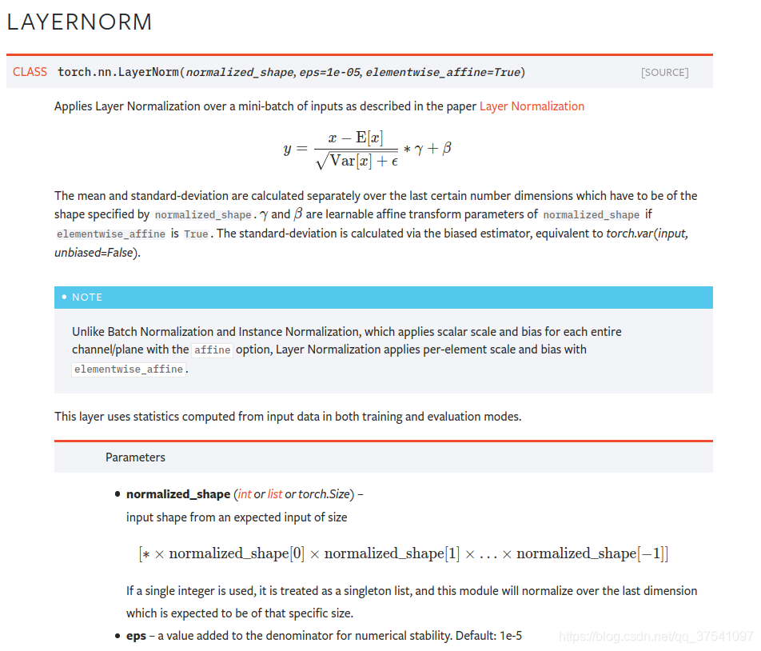
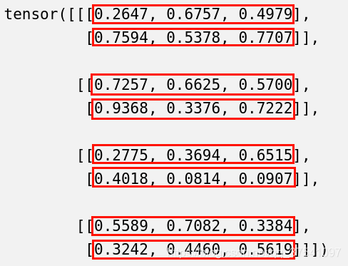

https://blog.csdn.net/qq_37541097/article/details/117653177

原论文名称：Layer Normalization
原论文地址：https://arxiv.org/abs/1607.06450

之前有讲过Batch Normalization的原理，[链接](https://blog.csdn.net/qq_37541097/article/details/104434557)，天来简单讲讲Layer Normalization。Layer Normalization是针对自然语言处理领域提出的，例如像RNN循环神经网络。为什么不使用直接BN呢，因为在RNN这类时序网络中，时序的长度并不是一个定值（网络深度不一定相同），比如每句话的长短都不一定相同，所有很难去使用BN，所以作者提出了Layer Normalization（注意，在图像处理领域中BN比LN是更有效的，但现在很多人将自然语言领域的模型用来处理图像，比如Vision Transformer，此时还是会涉及到LN）。

具体论文就不讲了，我们直接看下Pytorch官方给的关于LayerNorm的简单介绍。只看公式的话感觉和BN没什么区别，都是减均值 $E(x)$，除以标准差  $\sqrt{Var(x) + \epsilon }$ 其中 $\epsilon$ 是一个非常小的量（默认 $10^{-5}$ ），是为了防止分母为零。同样也有两个可训练的参数 $\beta, \gamma$。不同的是，BN是对一个batch数据的每个channel进行Norm处理，但LN是对单个数据的指定维度进行Norm处理与batch无关（后面有示例）。而且在BN中训练时是需要累计moving_mean和moving_var两个变量的（所以BN中有4个参数moving_mean,moving_var,$\beta, \gamma$），但LN不需要累计只有 $\beta, \gamma$ 两个参数。

在Pytorch的LayerNorm类中有个normalized_shape参数，可以指定你要Norm的维度（注意，函数说明中`the last certain number of dimensions`，指定的维度必须是从最后一维开始）。比如我们的数据的shape是[4, 2, 3]，那么normalized_shape可以是[3]（最后一维上进行Norm处理），也可以是[2, 3]（Norm最后两个维度），也可以是[4, 2, 3]（对整个维度进行Norm），但不能是[2]或者[4, 2]，否则会报以下错误（以normalized_shape=[2]为例）：

```
RuntimeError: 
Given normalized_shape=[2],         
expected input with shape [*, 2],    
but got input of size[4, 2, 3]
```

提示我们传入的normalized_shape=[2]，接着系统根据我们传入的normalized_shape推理出期待的输入数据shape应该为[*, 2]即最后的一个维度大小应该是2，但我们实际传入的数据shape是[4, 2, 3]所以报错了。

https://pytorch.org/docs/stable/generated/torch.nn.LayerNorm.html
$$
y = \frac {x - E[x]} {\sqrt {Var[x] + \epsilon}} * \gamma + \beta 
$$




接着，我们再来看个示例。下面是我写的测试代码，分别使用官方的LN方法和自己实现的LN方法进行比较，看自己理解的是否正确。

```python
import torch
import torch.nn as nn


def layer_norm_process(feature: torch.Tensor, beta=0., gamma=1., eps=1e-5):
    var_mean = torch.var_mean(feature, dim=-1, unbiased=False)
    # 均值
    mean = var_mean[1]
    # 方差
    var = var_mean[0]

    # layer norm process
    feature = (feature - mean[..., None]) / torch.sqrt(var[..., None] + eps)
    feature = feature * gamma + beta

    return feature


def main():
    t = torch.rand(4, 2, 3)
    print(t)
    # 仅在最后一个维度上做norm处理
    norm = nn.LayerNorm(normalized_shape=t.shape[-1], eps=1e-5)
    # 官方layer norm处理
    t1 = norm(t)
    # 自己实现的layer norm处理
    t2 = layer_norm_process(t, eps=1e-5)
    print("t1:\n", t1)
    print("t2:\n", t2)


if __name__ == '__main__':
    main()
```

首先使用torch.rand方法随机生成一个shape为[4, 2, 3]的变量t:



接着使用官方的方法创建一个LN层，这里`t.shape[-1]`指的是数据的最后一个维度3即只对最后一个维度进行Norm处理，如上图中用红色框框选出的每组数据：

```python
# 仅在最后一个维度上做norm处理
norm = nn.LayerNorm(normalized_shape=t.shape[-1], eps=1e-5)
```

然后将数据传入实例化好的norm类得到以下结果：

```python
 tensor([[[-1.2758,  1.1659,  0.1099],
         [ 0.6532, -1.4123,  0.7591]],

        [[ 1.1400,  0.1522, -1.2922],
         [ 1.0942, -1.3229,  0.2287]],

        [[-0.9757, -0.3983,  1.3741],
         [ 1.4134, -0.7379, -0.6755]],

        [[ 0.1563,  1.1389, -1.2951],
         [-1.2341,  0.0203,  1.2138]]], grad_fn=<NativeLayerNormBackward>)
```

然后调用自己实现的LayerNorm方法（注意， β \beta β最初为0， γ \gamma γ最初为1，后面通过训练慢慢学习调整的）得到如下结果：

```python
 tensor([[[-1.2758,  1.1659,  0.1099],
         [ 0.6532, -1.4123,  0.7591]],

        [[ 1.1400,  0.1522, -1.2922],
         [ 1.0942, -1.3229,  0.2287]],

        [[-0.9757, -0.3983,  1.3741],
         [ 1.4134, -0.7379, -0.6755]],

        [[ 0.1563,  1.1389, -1.2951],
         [-1.2341,  0.0203,  1.2138]]])
```

很明显和官方得到的结果是一模一样的，这也说明了自己的理解是正确的。