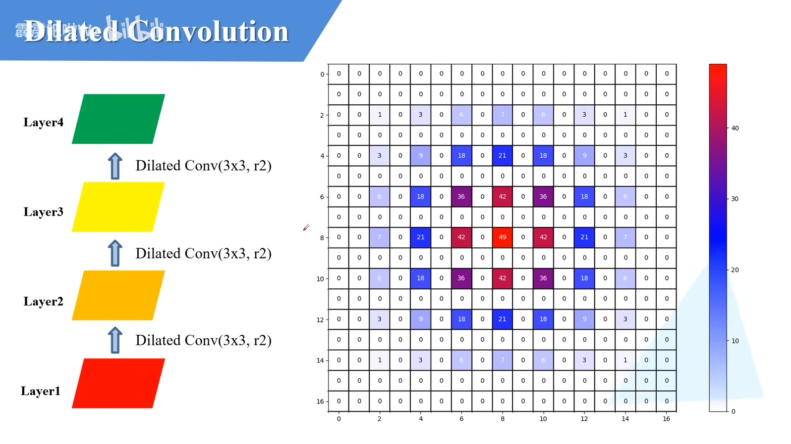

# 普通卷积 stride=2

# 膨胀卷积/孔洞卷积 增大感受野,保证输入输出大小不变

> 空洞卷积提升感受野,一般都是在网络的中后段使用的

k = 3

p = 0

s = 1

r = 2	膨胀因子

> 这里变小了,因为没有padding

# Gridding effect

> Gridding effect 会出现无用像素的情况

## 连续3次使用 3x3 膨胀卷积,膨胀系数为2 Bad

###  Layer2 

> 卷积核样式如图所示
>
> 空余数据没有使用

### Layer3上利用的像素会重复

> 有的数据重复使用
>
> 有的空余数据没有使用

### Layer4上利用的像素数据使用了3次

> 有的数据重复使用
>
> 有的空余数据没有使用

## 3次 3x3 卷积分别使用 r1 r2 r3 Good

### Layer2 r1 普通卷积

>利用了相邻的数据

### Layer3 r2

> 利用 7x7 所有数据

### Layer4 r3

> 利用 13x13 所有数据

## 3次全部采用 3x3 普通卷积 r1 Bad

### Layer2

> 获取 3x3 数据

### Layer3

> 获取 5x5 数据

### Layer4

> 获取 7x7 数据

# HDC 连续使用多个膨胀卷积的tips

## 调整膨胀系数

> Mi 指的是两个像素之间最大距离

> $i$ 指的是 i 层
>
> **$Mi$ 两个元素之间最大距离**
>
> **设计要求是 M2 <= K**
>
> 3个参数的最大值
>
> $Ri$ 膨胀系数
>
> 最后膨胀系数 $Mn = Rn$
>
> 示例:
>
> ​	k = 3 r = [1, 2, 5]
>
> ​	求M2
>
> ​    max(5-2*2, 5-2(5-2), 2)
>
> ​	max(1, -1, 2)
>
> ​	M2 = 2

## 将dilation rates 设置为矩阵结构,例如: [1, 2, 3, 1, 2, 3]

## 公约数不能大于1

> 1 3 5 可以
>
> 2 4 8 不可以

## 效果演示

> 第一行是人为标注
>
> 第二行是ResNet-DUC
>
> 第三行使用了HDC准则

