# 1 普通卷积


## 转置卷积主要为了上采样

# 3 转置卷积计算步骤

- 元素之间: s-1行/列

- 元素四周: k-p-1行/列

- 卷积核上下左右翻转

- 做正常卷积 p=0 s=1
- out  **0指的是高度方向 1指的是宽度方向**
    - $H_{out} = (H_{in} - 1) * stride[0] - 2 * padding[0] + kernel\_size[0]$
    - $W_{out} = (W_{in} - 1) * stride[1] - 2 * padding[1] + kernel\_size[1]$

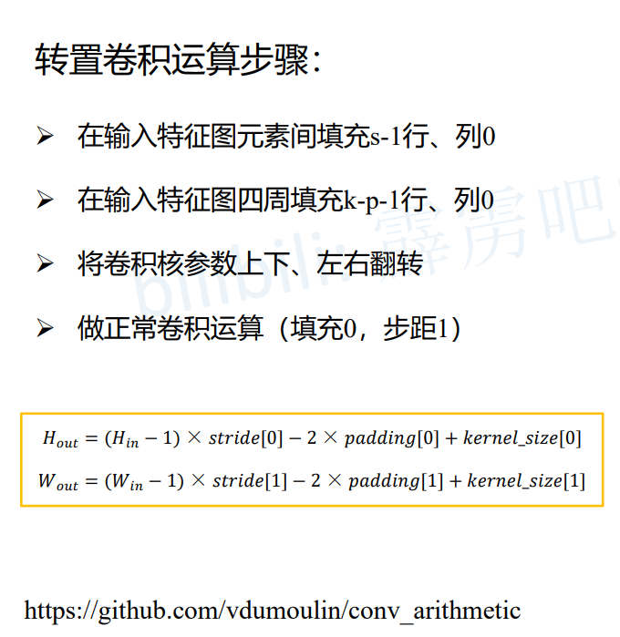


## 2x2->4x4 转置卷积 k=3 p=0 s=1

- 元素之间: s-1行/列    1-1=0

- 元素四周: k-p-1行/列  3-0-1=2

- 卷积核上下左右翻转

- 做正常卷积 p=0 s=1
- out  **0指的是高度方向 1指的是宽度方向**
    - $Hout = (Hin - 1) * stride[0] - 2 * padding[0] + kernelsize[0]$	(2 - 1) * 1 - 2 * 0 + 3 = 4
    - $Wout = (Win - 1) * stride[1] - 2 * padding[1] + kernelsize[1]$  (2 - 1) * 1 - 2 * 0 + 3 = 4


## 2x2->5x5 转置卷积 k=3 p=0 s=2 

- 元素之间: s-1行/列    2-1=1

- 元素四周: k-p-1行/列  3-0-1=2

- 卷积核上下左右翻转

- 做正常卷积 p=0 s=1
- out  **0指的是高度方向 1指的是宽度方向**
    - $Hout = (Hin - 1) * stride[0] - 2 * padding[0] + kernelsize[0]$	(2 - 1) * 2 - 2 * 0 + 3 = 5
    - $Wout = (Win - 1) * stride[1] - 2 * padding[1] + kernelsize[1]$  (2 - 1) * 2 - 2 * 0 + 3 = 5


## 3x3->5x5 转置卷积 k=3 p=1 s=2 

- 元素之间: s-1行/列    2-1=1

- 元素四周: k-p-1行/列  3-1-1=1

- 卷积核上下左右翻转

- 做正常卷积 p=0 s=1
- out  **0指的是高度方向 1指的是宽度方向**
    - $Hout = (Hin - 1) * stride[0] - 2 * padding[0] + kernelsize[0]$	(3 - 1) * 2 - 2 * 1 + 3 = 5
    - $Wout = (Win - 1) * stride[1] - 2 * padding[1] + kernelsize[1]$  (3 - 1) * 2 - 2 * 1 + 3 = 5


# 4 转置卷积实例

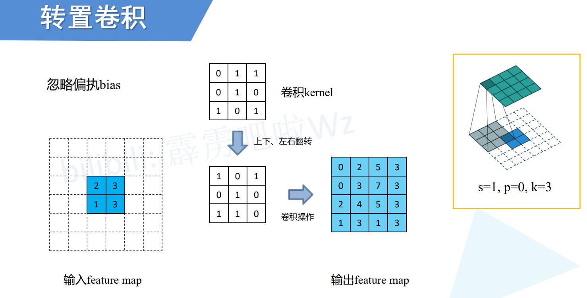

k=3 p=0 s=1

元素间 

- s-1行/列   1-1=0

元素四周 

- k-p-1行/列 3-0-1=2

    

# 5 nn.ConvTransposed2d()

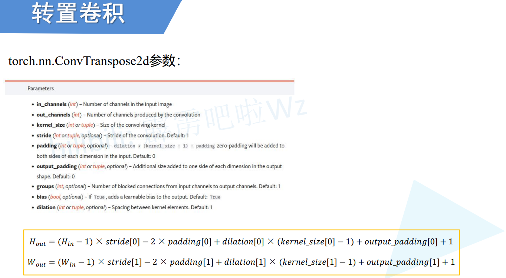

> 参数

- in_channels: 输入通道
- out_channels:输出通道
- kernel_size: 卷积核大小
- stride:  default 1
- padding: default 0
- output_padding: 最后卷积时的填充,一般不使用
- groups: 分组卷积 default 1
- bias: 偏执 default True
- dilation: 碰撞卷积/空洞卷积 default 1


```python
'''
元素之间: s-1行/列
元素四周: k-p-1行/列
卷积核上下左右翻转
做正常卷积 p=0 s=1
out  0指的是高度方向 1指的是宽度方向
    Hout = (Hin - 1) * stride[0] - 2 * padding[0] + kernelsize[0]
    Wout = (Win - 1) * stride[1] - 2 * padding[1] + kernelsize[1]
'''

import torch
from torch import nn


x = torch.rand(1, 1, 2, 2)
print("x size:", x.size())  # x size: torch.Size([1, 1, 2, 2])

# 2x2->4x4 转置卷积 k=3 p=0 s=1
model = nn.ConvTranspose2d(in_channels=1, out_channels=1, kernel_size=3, padding=0, stride=1)
y = model(x)
print("y size:", y.size())  # y size: torch.Size([1, 1, 4, 4])

# 2x2->5x5 转置卷积 k=3 p=0 s=2 
model = nn.ConvTranspose2d(in_channels=1, out_channels=1, kernel_size=3, padding=0, stride=2)
y = model(x)
print("y size:", y.size())  # y size: torch.Size([1, 1, 5, 5])


x = torch.rand(1, 1, 3, 3)
print("x size:", x.size())  # x size: torch.Size([1, 1, 3, 3])

# 3x3->5x5 转置卷积 k=3 p=1 s=2 
model = nn.ConvTranspose2d(in_channels=1, out_channels=1, kernel_size=3, padding=1, stride=2)
y = model(x)
print("y size:", y.size())  # y size: torch.Size([1, 1, 5, 5])

```


# 6 普通卷积计算

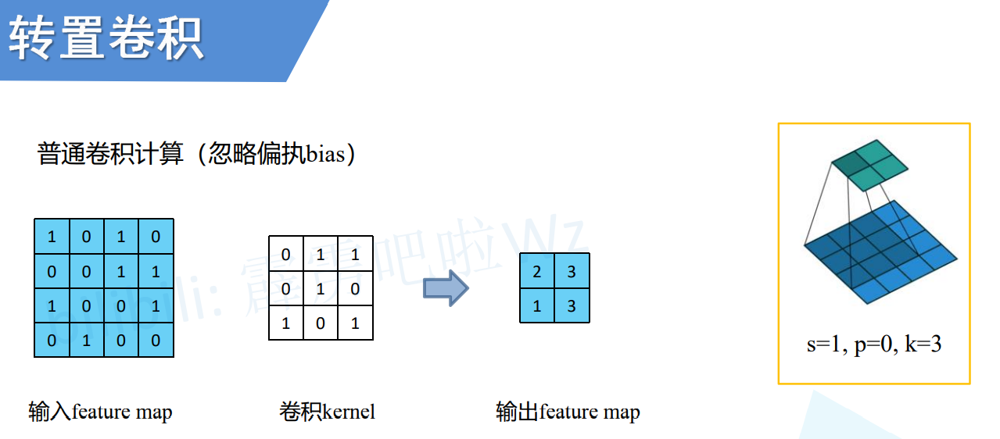

> 一般讲的是滑动窗口,但是那样效率低

## 高效的计算方式

### a 卷积核kernel构建等效矩阵,直接和输入矩阵相乘相加

> **记住这个卷积核**

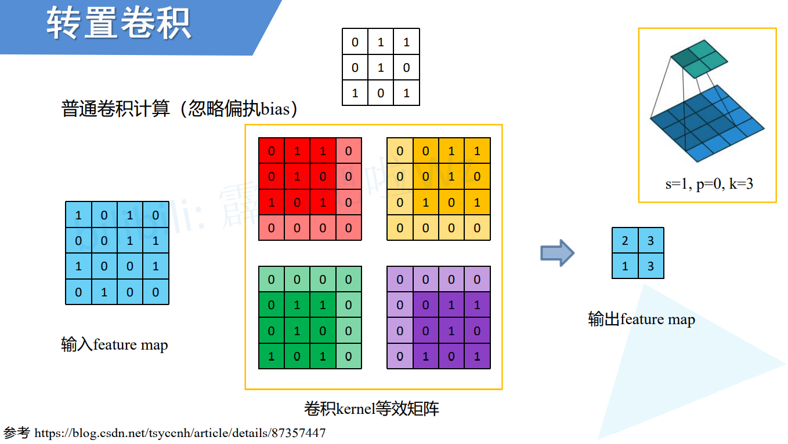

### b 展平输入矩阵得到 $I$

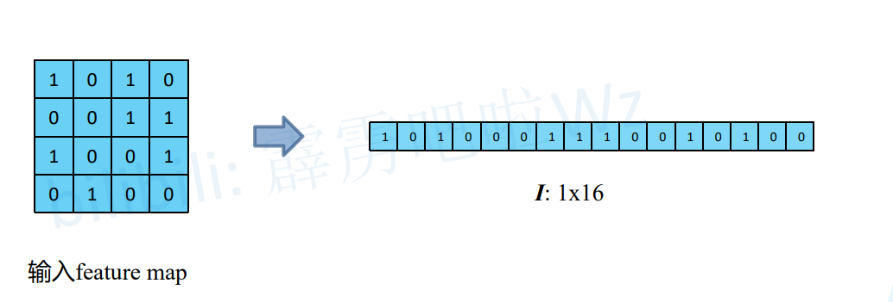

### c 卷积核等效矩阵也展平得到 $C$

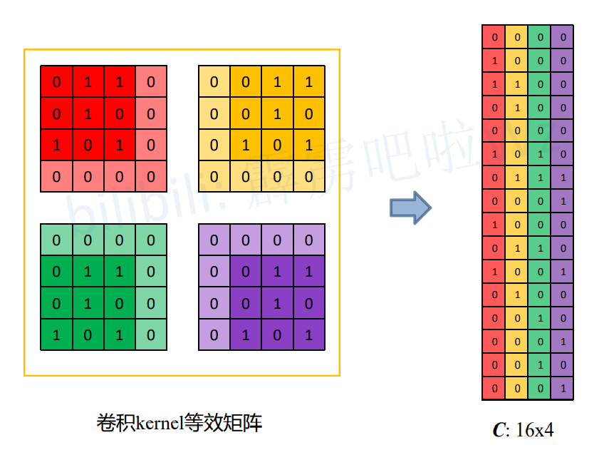

### d 再使用展平后的 $I$ 和 $C$ 相乘即可得到最终结构

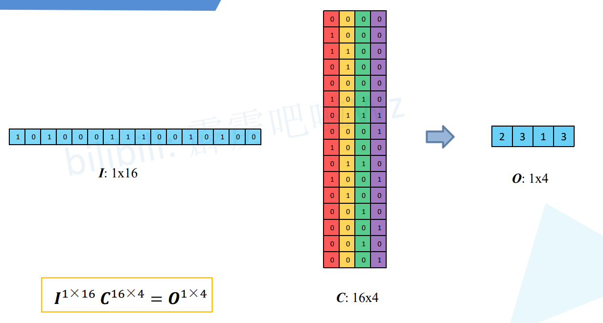

### e 尝试得到和出入大小相同的矩阵

> 矩阵C不存在逆矩阵,所以没法通过 $C$ 和 $O$ 还原到 $I$
>
> **矩阵必须为方形才有逆矩阵**
>
> 不过通过$O * C^T = P$可以得到和 $I$ 相同大小的矩阵

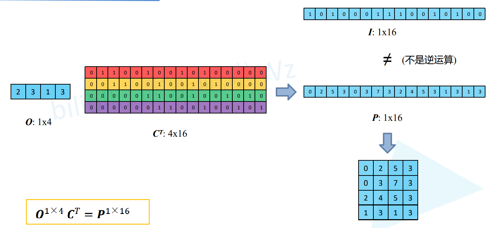

### f 矩阵形状还原

> $O$ 还原
>
> $C^T$ 还原
>
> $O$和$C^T$还原后的结果在相同位置上相乘就能得到$P$

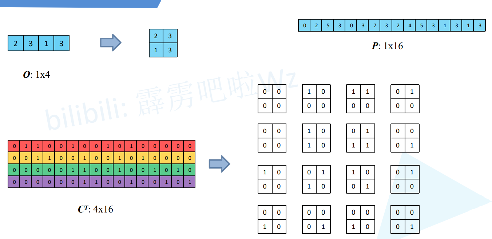

> 相同位置相乘为0
>
> 右下角的位置卷积结果也是0

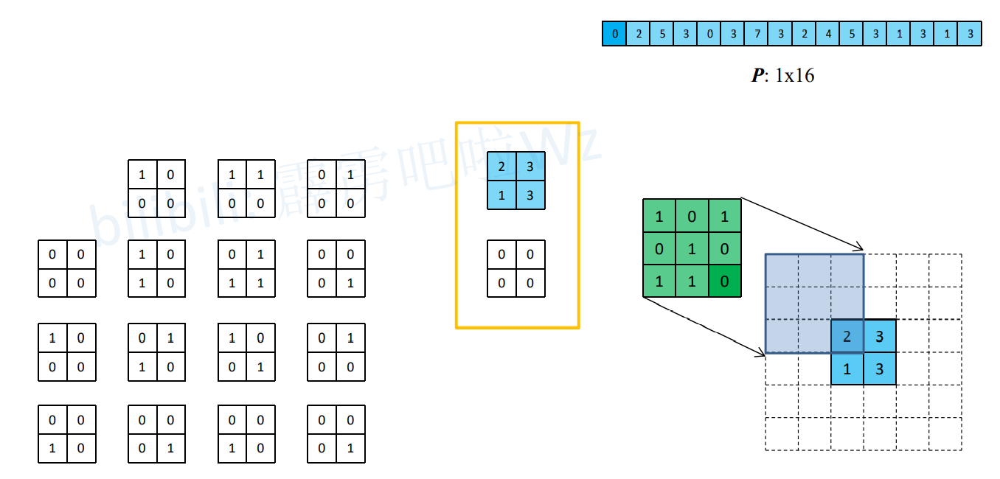

> 相同位置相乘为2
>
> 右下角的位置卷积结果也是2

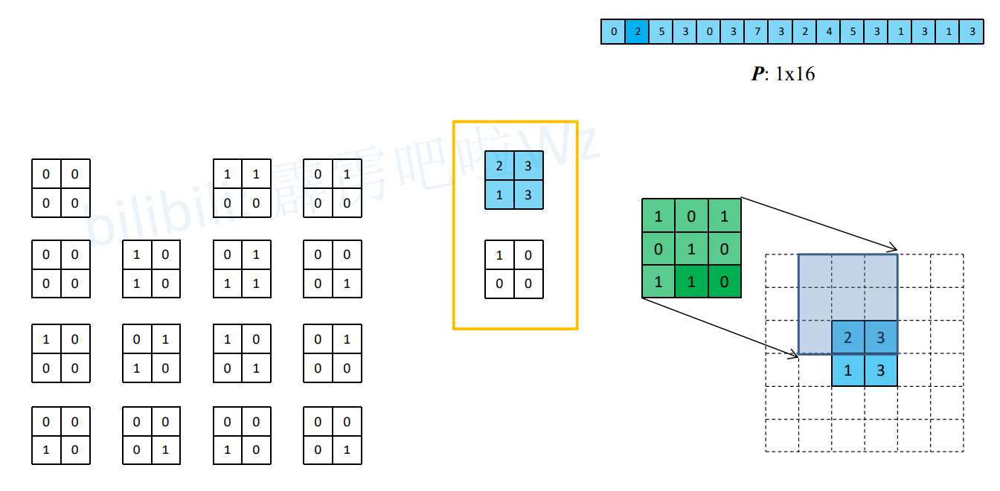

> 其他位置也相同

### g 卷积核特点

> **最开始的卷积和和这个绿色卷积核是上下左右卷积的结构**

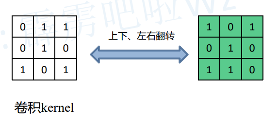

# 7 李沐讲解


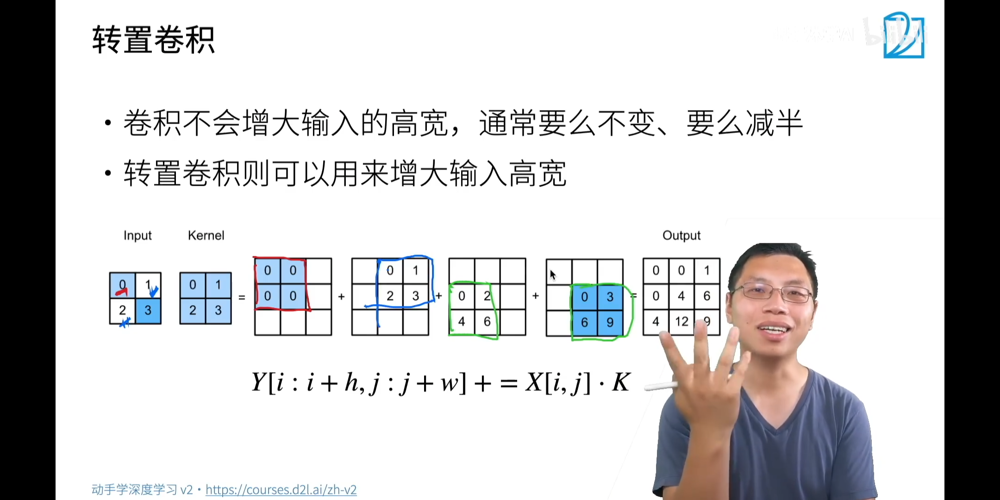

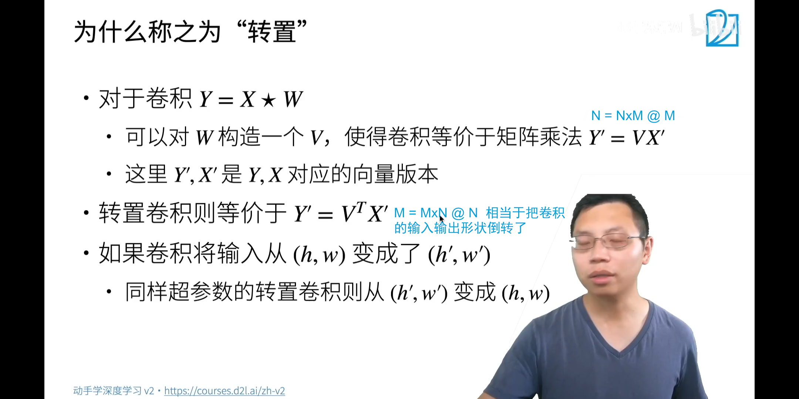


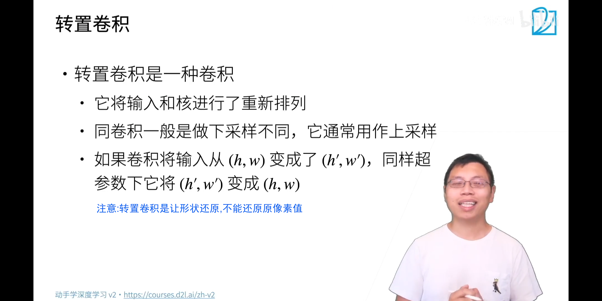

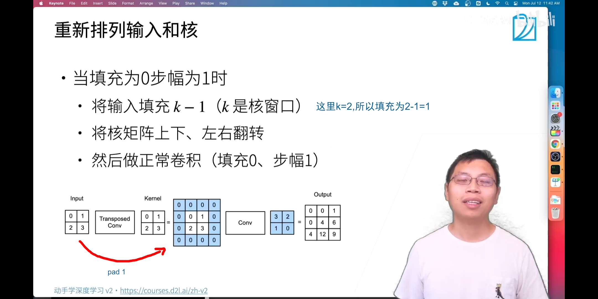

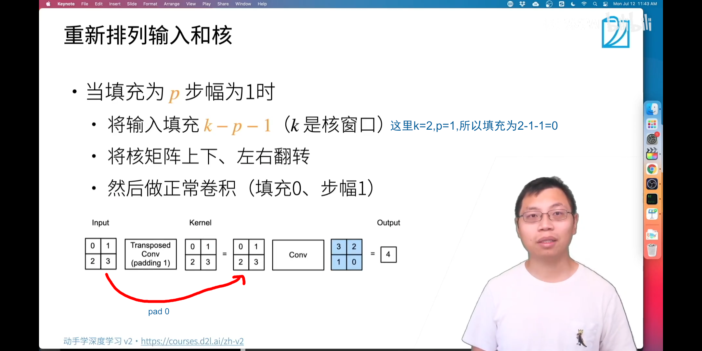

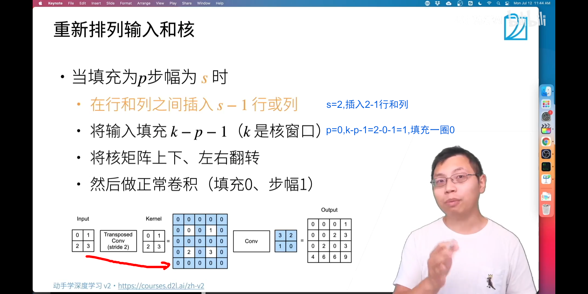

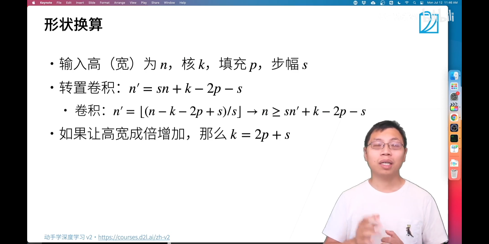

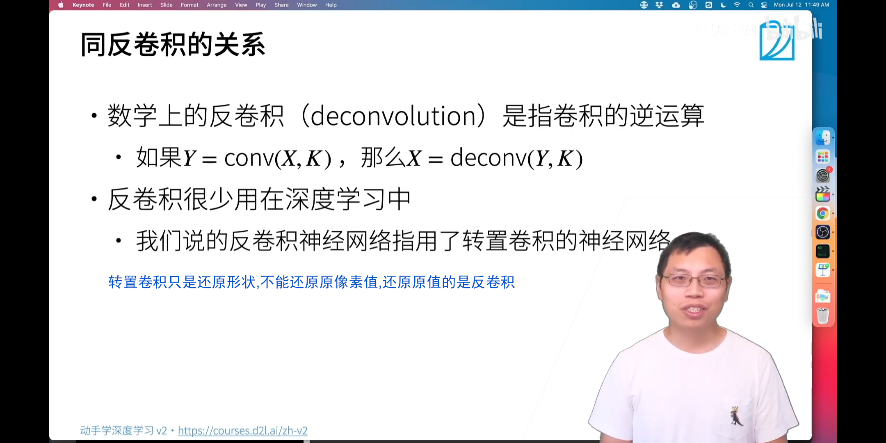
