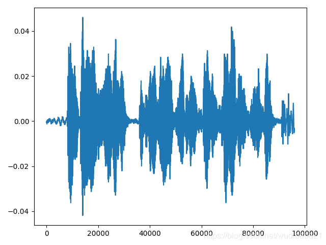

# torchaudio的笔记

**导入相关库**

```python
import torch
import torchaudio
import matplotlib.pyplot as plt
```

**torchaudio 支持以 wav 和 mp3 格式加载声音文件。 我们称波形为原始音频信号。**

```python
filename = "/home/AI_SHELL/wavs/BAC009S0002W0122.wav"

waveform,sample_rate = torchaudio.load(filename)

print("Shape of waveform:{}".format(waveform.size())) #音频大小
print("sample rate of waveform:{}".format(sample_rate))#采样率

plt.figure()
plt.plot(waveform.t().numpy())
plt.show()
```

**输出：** 

Shape of waveform:torch.Size([1, 95984])  # 表示单通道
sample rate of waveform:16000


​                 

## 转换

下面列出的是 torchaudio 支持的[转换](https://pytorch.org/audio/transforms.html)，这个列表还在不断增长中。

- **重采样**：将波形重新采样到不同的采样率。
- **频谱**图：从波形创建频谱图。
- **MelScale**：它使用转换矩阵将普通 STFT 转换为梅尔频率 STFT。
- **AmplitudeToDB**：它将一个频谱图从功率/振幅刻度转换为分贝刻度。
- **MFCC**：从波形创建梅尔频率的cepstrum系数。
- **MelSpectrogram**：使用 PyTorch 中的 STFT 函数从波形创建 MEL 频谱图。
- **MuLawEncoding**：基于mu-law比较编码波形。
- **MuLawDecode：**解码mu-law编码波形。

由于所有变换都是 nn.Modules 或 jit.ScriptModules，它们可以随时用作神经网络的一部分。

首先，我们可以以对数刻度查看频谱图的对数。

```python
specgram = torchaudio.transforms.Spectrogram()(waveform)
print("Shape of spectrogram:{}".format(specgram.size()))
plt.figure()
plt.imshow(specgram.log2()[0,:,:].numpy(),cmap='gray')
plt.show()
```

结果：

Shape of spectrogram:torch.Size([1, 201, 480])

​               或

者我们可以以对数刻度查看梅尔频谱图。 

```python
specgram = torchaudio.transforms.MelSpectrogram()(waveform)
print("Shape of spectrogram:{}".format(specgram.size()))
plt.figure()
p = plt.imshow(specgram.log2()[0,:,:].detach().numpy(),cmap='gray')
plt.show()
```

结果：

```
Shape of spectrogram:torch.Size([1, 128, 480])
```

​                           

我们可以重新采样波形，一次一个通道。

```python
new_sample_rate = sample_rate/10
channel = 0
transformed = torchaudio.transforms.Resample(sample_rate,new_sample_rate)(waveform[channel,:].view(1,-1))
print("Shape of transformed waveform:{}".format(transformed.size()))
plt.figure()
plt.plot(transformed[0,:].numpy())
plt.show()
```

 结果：

Shape of transformed waveform:torch.Size([1, 9599])


作为转换的另一个示例，我们可以基于 Mu-Law enen 对信号进行编码。 但为此，我们需要的信号介于 -1 和 1 之间。 由于这个张量只是一个常规的 PyTorch 张量，因此我们可以对其应用标准操作符。

```python
print("Min of waveform:{}\nMax of waveform:{}\nMean of waveform:{}".format(waveform.min(),waveform.max(),waveform.mean()))
```

结果：

 Min of waveform:-0.041259765625
 Max of waveform:0.047088623046875
 Mean of waveform:-1.7875789126264863e-05 

由于波形已经在 -1 和 1 之间，因此我们不需要将其规范化。

```
def normalize(tensor):
    # Subtract the mean, and scale to the interval [-1,1]
    tensor_minusmean = tensor - tensor.mean()
    return tensor_minusmean/tensor_minusmean.abs().max()

# Let's normalize to the full interval [-1,1]
# waveform = normalize(waveform)
```

让我们应用编码波形。

```python
transformed = torchaudio.transforms.MuLawEncoding()(waveform)
pe of transformed waveform: {}".format(transformed.size()))
plt.figure()
plt.plot(transformed[0,:].numpy())
plt.show()
```


现在解码。

```python
reconstructed = torchaudio.transforms.MuLawDecoding()(transformed)
print("Shape of recovered waveform: {}".format(reconstructed.size()))
plt.figure()
plt.plot(reconstructed[0,:].numpy())
plt.show()
```

 

我们终于可以将原始波形与其重建版本进行比较。

```
err = ((waveform-reconstructed).abs() / waveform.abs()).median()
print("Median relative difference between original and MuLaw reconstucted signals: {:.2%}".format(err))
```

 

