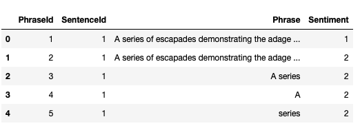
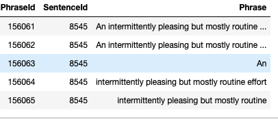
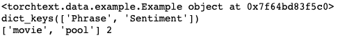
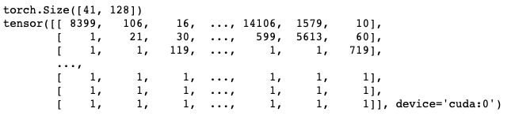

# Torchtext使用教程

## 主要内容：

- 如何使用torchtext建立语料库
- 如何使用torchtext将词转下标，下标转词，词转词向量
- 如何建立相应的迭代器

## torchtext预处理流程：

1. 定义Field：声明如何处理数据
2. 定义Dataset：得到数据集，此时数据集里每一个样本是一个 经过 **Field声明的预处理** 预处理后的 wordlist
3. 建立vocab：在这一步建立词汇表，词向量(word embeddings)
4. 构造迭代器：构造迭代器，用来分批次训练模型

# 下载数据：

kaggle：Movie Review Sentiment Analysis (Kernels Only)
train.tsv contains the phrases and their associated sentiment labels. We have additionally provided a SentenceId so that you can track which phrases belong to a single sentence.

test.tsv contains just phrases. You must assign a sentiment label to each phrase.

The sentiment labels are:
 0 - negative
 1 - somewhat negative
 2 - neutral
 3 - somewhat positive
 4 - positive

下载得到：train.tsv和test.tsv

## 1 读取文件，查看文件

```python
import pandas as pd
data = pd.read_csv('train.tsv', sep='\t')
test = pd.read_csv('test.tsv', sep='\t')
```

### train.tsv

```python
data[:5]
```



### test.tsv

```python
test[:5]
```




# 2 划分验证集

```python
from sklearn.model_selection import train_test_split
# create train and validation set 

train, val = train_test_split(data, test_size=0.2)
train.to_csv("train.csv", index=False)
val.to_csv("val.csv", index=False)
```

# 3 定义Field

首先导入需要的包和定义pytorch张量使用的DEVICE

```python
import spacy
import torch
from torchtext import data, datasets
from torchtext.vocab import Vectors
from torch.nn import init

DEVICE = torch.device("cuda" if torch.cuda.is_available() else "cpu")
```

Torchtext采用了一种声明式的方法来加载数据：你来告诉Torchtext你希望的数据是什么样子的，剩下的由torchtext来处理。
实现这种声明的是Field，Field确定了一种你想要怎么去处理数据。
data.Field(…)

Field的参数如下：

- sequential: Whether the datatype represents sequential data. If False, no tokenization is applied. 
    - Default: True.
- use_vocab: Whether to use a Vocab object. If False, the data in this field should already be numerical. 
    - Default: True.
- init_token: A token that will be prepended to every example using this field, or None for no initial token. 
    - Default: None.
- eos_token: A token that will be appended to every example using this field, or None for no end-of-sentence token. 
    - Default: None.
- fix_length: A fixed length that all examples using this field will be padded to, or None for flexible sequence lengths. 
    - Default: None.
- dtype: The torch.dtype class that represents a batch of examples of this kind of data. 
    - Default: torch.long.
- preprocessing: The Pipeline that will be applied to examples using this field after tokenizing but before numericalizing. Many Datasets replace this attribute with a custom preprocessor. 
    - Default: None.
- postprocessing: A Pipeline that will be applied to examples using this field after numericalizing but before the numbers are turned into a Tensor. The pipeline function takes the batch as a list, and the field’s Vocab. 
    - Default: None.
- lower: Whether to lowercase the text in this field. 
    - Default: False.
- tokenize: The function used to tokenize strings using this field into sequential examples. If “spacy”, the SpaCy tokenizer is used. If a non-serializable function is passed as an argument, the field will not be able to be serialized. 
    -  Default: string.split.
- tokenizer_language: The language of the tokenizer to be constructed. Various languages currently supported only in SpaCy.
- include_lengths: Whether to return a tuple of a padded minibatch and a list containing the lengths of each examples, or just a padded minibatch. 
    - Default: False.
- batch_first: Whether to produce tensors with the batch dimension first. 
    - Default: False.
- pad_token: The string token used as padding. 
    - Default: “”.
- unk_token: The string token used to represent OOV words. 
    - Default: “”.
- pad_first: Do the padding of the sequence at the beginning. 
    - Default: False.
- truncate_first: Do the truncating of the sequence at the beginning. 
    - Default: False
- stop_words: Tokens to discard during the preprocessing step. 
    - Default: None
- is_target: Whether this field is a target variable. Affects iteration over batches. 
    - Default: False

例：

```python
spacy_en = spacy.load('en')

def tokenizer(text): # create a tokenizer function
    """
    定义分词操作
    """
    return [tok.text for tok in spacy_en.tokenizer(text)]

"""
field在默认的情况下都期望一个输入是一组单词的序列，并且将单词映射成整数。
这个映射被称为vocab。如果一个field已经被数字化了并且不需要被序列化，
可以将参数设置为use_vocab=False以及sequential=False。
"""
LABEL = data.Field(sequential=False, use_vocab=False)

TEXT = data.Field(sequential=True, tokenize=tokenizer, lower=True)
```


# 4 定义Dataset

The fields知道当给定原始数据的时候要做什么。现在，我们需要告诉fields它需要处理什么样的数据。这个功能利用Datasets来实现。

Torchtext有大量内置的Datasets去处理各种数据格式。

**TabularDataset官网介绍: Defines a Dataset of columns stored in CSV, TSV, or JSON format.**

对于csv/tsv类型的文件，TabularDataset很容易进行处理，故我们选它来生成Dataset

```python
"""
我们不需要 'PhraseId' 和 'SentenceId'这两列, 所以我们给他们的field传递 None
如果你的数据有列名，如我们这里的'Phrase','Sentiment',...
设置skip_header=True,不然它会把列名也当一个数据处理
"""
train,val = data.TabularDataset.splits(
        path='.', train='train.csv',validation='val.csv', format='csv',skip_header=True,
        fields=[('PhraseId',None),('SentenceId',None),('Phrase', TEXT), ('Sentiment', LABEL)])

test = data.TabularDataset('test.tsv', format='tsv',skip_header=True,
        fields=[('PhraseId',None),('SentenceId',None),('Phrase', TEXT)])
```

**注意：传入的(name, field)必须与列的顺序相同。**

查看生成的dataset：

```python
print(train[5])
print(train[5].__dict__.keys())
print(train[5].Phrase,train[0].Sentiment)
```


 

# 5 建立vocab

我们可以看到第6行的输入，它是一个Example对象。Example对象绑定了一行中的所有属性，可以看到，句子已经被分词了，但是没有转化为数字。

这是因为我们还没有建立vocab，我们将在下一步建立vocab。

Torchtext可以将词转化为数字，但是它需要被告知需要被处理的全部范围的词。我们可以用下面这行代码

```python
TEXT.build_vocab(train, vectors='glove.6B.100d')#, max_size=30000)
# 当 corpus 中有的 token 在 vectors 中不存在时 的初始化方式.
TEXT.vocab.vectors.unk_init = init.xavier_uniform
```

这行代码使得 Torchtext遍历**训练集**中的绑定TEXT field的数据，将单词注册到vocabulary，并自动构建embedding矩阵。

**’glove.6B.100d’ 为torchtext支持的词向量名字，第一次使用是会自动下载并保存在当前目录的 .vector_cache里面。**

> torchtext支持的词向量

- charngram.100d
- fasttext.en.300d
- fasttext.simple.300d
- glove.42B.300d
- glove.840B.300d
- glove.twitter.27B.25d
- glove.twitter.27B.50d
- glove.twitter.27B.100d
- glove.twitter.27B.200d
- glove.6B.50d
- glove.6B.100d
- glove.6B.200d
- glove.6B.300d

**例：**

如果打算使用fasttext.en.300d词向量，只需把上面的代码里的vector=’…'里面的词向量名字换一下即可，具体如下：

```python
TEXT.build_vocab(train, vectors='fasttext.en.300d')
```

到这一步，我们已经可以把**词转为数字，数字转为词，词转为词向量**了

```python
print(TEXT.vocab.itos[1510])
print(TEXT.vocab.stoi['bore'])
# 词向量矩阵: TEXT.vocab.vectors
print(TEXT.vocab.vectors.shape)
word_vec = TEXT.vocab.vectors[TEXT.vocab.stoi['bore']]
print(word_vec.shape)
print(word_vec)
```

# 6 构造迭代器

我们日常使用pytorch训练网络时，每次训练都是输入一个batch，那么，我们怎么把前面得到的dataset转为迭代器，然后遍历迭代器获取batch输入呢？下面将介绍torchtext时怎么实现这一功能的。

和Dataset一样，torchtext有大量内置的迭代器，我们这里选择的是BucketIterator，官网对它的介绍如下：

- Defines an iterator that batches examples of similar lengths together.
- Minimizes amount of padding needed while producing freshly shuffled batches for each new epoch.

```python
train_iter = data.BucketIterator(train, batch_size=128, sort_key=lambda x: len(x.Phrase), 
                                 shuffle=True,device=DEVICE)

val_iter = data.BucketIterator(val, batch_size=128, sort_key=lambda x: len(x.Phrase), 
                                 shuffle=True,device=DEVICE)

# 在 test_iter , sort一定要设置成 False, 要不然会被 torchtext 搞乱样本顺序
test_iter = data.Iterator(dataset=test, batch_size=128, train=False,
                          sort=False, device=DEVICE)
```

## 迭代器使用

### 方法一

```python
batch = next(iter(train_iter))
data = batch.Phrase
label = batch.Sentiment
print(batch.Phrase.shape)
print(batch.Phrase)
```

输出结果：
 
 可以发现，它输出的是word index，后面的128是batch size

### 方法二

```python
for batch in train_iter:
    data = batch.Phrase
    label = batch.Sentiment
```

# 7 完整代码

```python
import spacy
import torch
from torchtext import data, datasets
from torchtext.vocab import Vectors
from torch.nn import init
import torch.nn as nn
import torch.nn.functional as F
import torch.optim as optim
import numpy as np
from sklearn.model_selection import train_test_split
import pandas as pd

DEVICE = torch.device("cuda" if torch.cuda.is_available() else "cpu")

data = pd.read_csv('train.tsv', sep='\t')
test = pd.read_csv('test.tsv', sep='\t')

# create train and validation set 
train, val = train_test_split(data, test_size=0.2)
train.to_csv("train.csv", index=False)
val.to_csv("val.csv", index=False)

spacy_en = spacy.load('en')

def tokenizer(text): # create a tokenizer function
    return [tok.text for tok in spacy_en.tokenizer(text)]
# Field
TEXT = data.Field(sequential=True, tokenize=tokenizer, lower=True)
LABEL = data.Field(sequential=False, use_vocab=False)

# Dataset
train,val = data.TabularDataset.splits(
        path='.', train='train.csv',validation='val.csv', format='csv',skip_header=True,
        fields=[('PhraseId',None),('SentenceId',None),('Phrase', TEXT), ('Sentiment', LABEL)])

test = data.TabularDataset('test.tsv', format='tsv',skip_header=True,
        fields=[('PhraseId',None),('SentenceId',None),('Phrase', TEXT)])
# build vocab
TEXT.build_vocab(train, vectors='glove.6B.100d')#, max_size=30000)
TEXT.vocab.vectors.unk_init = init.xavier_uniform

# Iterator
train_iter = data.BucketIterator(train, batch_size=128, sort_key=lambda x: len(x.Phrase), 
                                 shuffle=True,device=DEVICE)

val_iter = data.BucketIterator(val, batch_size=128, sort_key=lambda x: len(x.Phrase), 
                                 shuffle=True,device=DEVICE)

# 在 test_iter , sort一定要设置成 False, 要不然会被 torchtext 搞乱样本顺序
test_iter = data.Iterator(dataset=test, batch_size=128, train=False,
                          sort=False, device=DEVICE)
"""
由于目的是学习torchtext的使用，所以只定义了一个简单模型
"""
len_vocab = len(TEXT.vocab)

class Enet(nn.Module):
    def __init__(self):
        super(Enet, self).__init__()
        self.embedding = nn.Embedding(len_vocab,100)
        self.lstm = nn.LSTM(100,128,3,batch_first=True)#,bidirectional=True)
        self.linear = nn.Linear(128,5)
        
    def forward(self, x):
        batch_size,seq_num = x.shape
        vec = self.embedding(x)
        out, (hn, cn) = self.lstm(vec)
        out = self.linear(out[:,-1,:])
        out = F.softmax(out,-1)
        return out


model = Enet()
"""
将前面生成的词向量矩阵拷贝到模型的embedding层
这样就自动的可以将输入的word index转为词向量
"""
model.embedding.weight.data.copy_(TEXT.vocab.vectors)   
model.to(DEVICE)

# 训练
optimizer = optim.Adam(model.parameters())#,lr=0.000001)

n_epoch = 20

best_val_acc = 0

for epoch in range(n_epoch):

    for batch_idx, batch in enumerate(train_iter):
        data = batch.Phrase
        target = batch.Sentiment
        target = torch.sparse.torch.eye(5).index_select(dim=0, index=target.cpu().data)
        target = target.to(DEVICE)
        data = data.permute(1,0)
        optimizer.zero_grad()

        out = model(data)
        loss = -target*torch.log(out)-(1-target)*torch.log(1-out)
        loss = loss.sum(-1).mean()

        loss.backward()
        optimizer.step()

        if (batch_idx+1) %200 == 0:
            _,y_pre = torch.max(out,-1)
            acc = torch.mean((torch.tensor(y_pre == batch.Sentiment,dtype=torch.float)))
            print('epoch: %d \t batch_idx : %d \t loss: %.4f \t train acc: %.4f'
                  %(epoch,batch_idx,loss,acc))
    
    val_accs = []
    for batch_idx, batch in enumerate(val_iter):
        data = batch.Phrase
        target = batch.Sentiment
        target = torch.sparse.torch.eye(5).index_select(dim=0, index=target.cpu().data)
        target = target.to(DEVICE)
        data = data.permute(1,0)
        out = model(data)
        
        _,y_pre = torch.max(out,-1)
        acc = torch.mean((torch.tensor(y_pre == batch.Sentiment,dtype=torch.float)))
        val_accs.append(acc)
    
    acc = np.array(val_accs).mean()
    if acc > best_val_acc:
        print('val acc : %.4f > %.4f saving model'%(acc,best_val_acc))
        torch.save(model.state_dict(), 'params.pkl')
        best_val_acc = acc
    print('val acc: %.4f'%(acc))

```

