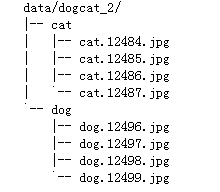
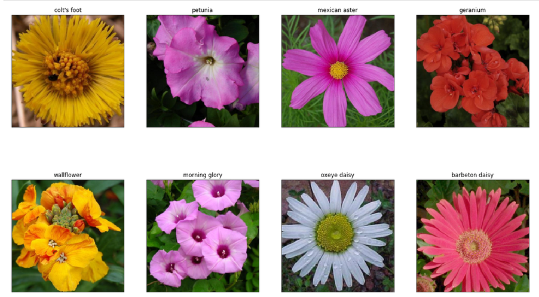

# pytorch之ImageFolder

torchvision已经预先实现了常用的Dataset，包括前面使用过的CIFAR-10，以及ImageNet、COCO、MNIST、LSUN等数据集，可通过诸如torchvision.datasets.CIFAR10来调用。在这里介绍一个会经常使用到的Dataset——ImageFolder。ImageFolder假设所有的文件按文件夹保存，每个文件夹下存储同一个类别的图片，文件夹名为类名，其构造函数如下：

`ImageFolder(root, transform=None, target_transform=None, loader=default_loader)`

它主要有四个参数：

- root：**在root指定的路径下寻找图片(里面有文件夹(名字就是标签),再里面就是图片了)**
- transform：对PIL Image进行的转换操作，transform的输入是使用loader读取图片的返回对象
- target_transform：对label的转换
- loader：给定路径后如何读取图片，默认读取为RGB格式的PIL Image对象

label是按照文件夹名顺序排序后存成字典，即{类名:类序号(从0开始)}，一般来说最好直接将文件夹命名为从0开始的数字，这样会和ImageFolder实际的label一致，如果不是这种命名规范，建议看看self.class_to_idx属性以了解label和文件夹名的映射关系。

```python
from torchvision.datasets import ImageFolder

dataset = ImageFolder('data/dogcat_2/')

# cat文件夹的图片对应label 0，dog对应1
print(dataset.class_to_idx)
```




## class_to_idx 文件夹名字2idx 字典

```python
import torch
import torch.nn as nn
import torch.optim as optim
import torch.nn.functional as F
from torchvision import datasets,transforms 
import matplotlib.pyplot as plt
import numpy as np


# 定义超参数 
input_size = 28   # 图像的总尺寸28*28
num_classes = 10  # 标签的种类数
num_epochs = 3    # 训练的总循环周期
batch_size = 64   # 一个撮（批次）的大小，64张图片

# 训练集
train_dataset = datasets.MNIST(root='./data',  
                            train=True,   
                            transform=transforms.ToTensor(),  
                            download=True) 

# 测试集
test_dataset = datasets.MNIST(root='./data', 
                           train=False, 
                           transform=transforms.ToTensor())

print(test_dataset.class_to_idx)
# {'0 - zero': 0, '1 - one': 1, '2 - two': 2, '3 - three': 3, '4 - four': 4, '5 - five': 5, '6 - six': 6, '7 - seven': 7, '8 - eight': 8, '9 - nine': 9}
```

## .classes 文件夹名字列表(可以通过idx直接索引)

# 花朵数据集

## train / valid 

> 这里面的文件夹名字是类的名字,不建议使用数字,建议使用文字


## 标签

> 文件夹名字

```json
{
    "21": "fire lily",
    "3": "canterbury bells",
    "45": "bolero deep blue",
    "1": "pink primrose",
    "34": "mexican aster",
    "27": "prince of wales feathers",
    "7": "moon orchid",
    "16": "globe-flower",
    "25": "grape hyacinth",
    "26": "corn poppy",
    "79": "toad lily",
    "39": "siam tulip",
    "24": "red ginger",
    "67": "spring crocus",
    "35": "alpine sea holly",
    "32": "garden phlox",
    "10": "globe thistle",
    "6": "tiger lily",
    "93": "ball moss",
    "33": "love in the mist",
    "9": "monkshood",
    "102": "blackberry lily",
    "14": "spear thistle",
    "19": "balloon flower",
    "100": "blanket flower",
    "13": "king protea",
    "49": "oxeye daisy",
    "15": "yellow iris",
    "61": "cautleya spicata",
    "31": "carnation",
    "64": "silverbush",
    "68": "bearded iris",
    "63": "black-eyed susan",
    "69": "windflower",
    "62": "japanese anemone",
    "20": "giant white arum lily",
    "38": "great masterwort",
    "4": "sweet pea",
    "86": "tree mallow",
    "101": "trumpet creeper",
    "42": "daffodil",
    "22": "pincushion flower",
    "2": "hard-leaved pocket orchid",
    "54": "sunflower",
    "66": "osteospermum",
    "70": "tree poppy",
    "85": "desert-rose",
    "99": "bromelia",
    "87": "magnolia",
    "5": "english marigold",
    "92": "bee balm",
    "28": "stemless gentian",
    "97": "mallow",
    "57": "gaura",
    "40": "lenten rose",
    "47": "marigold",
    "59": "orange dahlia",
    "48": "buttercup",
    "55": "pelargonium",
    "36": "ruby-lipped cattleya",
    "91": "hippeastrum",
    "29": "artichoke",
    "71": "gazania",
    "90": "canna lily",
    "18": "peruvian lily",
    "98": "mexican petunia",
    "8": "bird of paradise",
    "30": "sweet william",
    "17": "purple coneflower",
    "52": "wild pansy",
    "84": "columbine",
    "12": "colt's foot",
    "11": "snapdragon",
    "96": "camellia",
    "23": "fritillary",
    "50": "common dandelion",
    "44": "poinsettia",
    "53": "primula",
    "72": "azalea",
    "65": "californian poppy",
    "80": "anthurium",
    "76": "morning glory",
    "37": "cape flower",
    "56": "bishop of llandaff",
    "60": "pink-yellow dahlia",
    "82": "clematis",
    "58": "geranium",
    "75": "thorn apple",
    "41": "barbeton daisy",
    "95": "bougainvillea",
    "43": "sword lily",
    "83": "hibiscus",
    "78": "lotus lotus",
    "88": "cyclamen",
    "94": "foxglove",
    "81": "frangipani",
    "74": "rose",
    "89": "watercress",
    "73": "water lily",
    "46": "wallflower",
    "77": "passion flower",
    "51": "petunia"
}
```


```python
import os
import matplotlib.pyplot as plt
%matplotlib inline
import numpy as np
import torch
from torch import nn
from torch.utils.data import Dataloader,Dataset
import torch.optim as optim
import torchvision
#pip install torchvision
from torchvision import transforms, models, datasets
#https://pytorch.org/docs/stable/torchvision/index.html
import imageio
import time
import warnings
import random
import sys
import copy
import json
from PIL import Image

# 图片路径
data_dir = './flower_data/'
train_dir = data_dir + '/train'
valid_dir = data_dir + '/valid'

# data_transforms中指定了所有图像预处理操作
# ImageFolder假设所有的文件按文件夹保存好，每个文件夹下面存贮同一类别的图片，文件夹的名字为分类的名字
data_transforms = {
    'train': transforms.Compose([
        transforms.Resize(int(224*1.25)),                       # 缩放
        transforms.RandomRotation(15),						    # 随机旋转，-45到45度之间随机选
        transforms.RandomCrop((224, 224)),  				    # 随机剪裁
        transforms.RandomHorizontalFlip(p=0.5),                 # 随机水平翻转 选择一个概率概率
        transforms.RandomVerticalFlip(p=0.5),                   # 随机垂直翻转
        transforms.ColorJitter(brightness=0.2, contrast=0.1, saturation=0.1, hue=0.1),# 参数1为亮度，参数2为对比度，参数3为饱和度，参数4为色相
        transforms.RandomGrayscale(p=0.025),                    # 概率转换成灰度率，3通道就是R=G=B
        transforms.ToTensor(),
        transforms.Normalize([0.485, 0.456, 0.406],             # 均值，标准差
                             [0.229, 0.224, 0.225])
    ]),
    'valid': transforms.Compose([
        transforms.Resize(int(224*1.25)),                       # 缩放
        transforms.RandomCrop((224, 224)),  				    # 随机剪裁
        transforms.ToTensor(),
        transforms.Normalize([0.485, 0.456, 0.406], [0.229, 0.224, 0.225])
    ]),
    'test': transforms.Compose([
        transforms.Resize(int(224*1.25)),                       # 缩放
        transforms.RandomCrop((224, 224)),  				    # 随机剪裁
        transforms.ToTensor(),
        transforms.Normalize([0.485, 0.456, 0.406], [0.229, 0.224, 0.225])
    ])
}
```

## 数据集

```python
batch_size = 8

# 通过遍历的方式制作两个dataset,dataloader,dataset_size
image_datasets = {x: datasets.ImageFolder(os.path.join(data_dir, x), data_transforms[x]) for x in ['train', 'valid']}
dataloaders    = {x: DataLoader(image_datasets[x], batch_size=batch_size, shuffle=True) for x in ['train', 'valid']}
dataset_sizes  = {x: len(image_datasets[x]) for x in ['train', 'valid']}

# 文件夹名字列表(可以通过idx直接索引)
# 1 10 100 102 等
class_names = image_datasets['train'].classes
```

## 数据集详细信息

```python
image_datasets
# {'train': Dataset ImageFolder
#      Number of datapoints: 6552
#      Root location: ./flower_data/train
#      StandardTransform
#  Transform: Compose(
#                 RandomRotation(degrees=[-45.0, 45.0], interpolation=nearest, expand=False, fill=0)
#                 CenterCrop(size=(224, 224))
#                 RandomHorizontalFlip(p=0.5)
#                 RandomVerticalFlip(p=0.5)
#                 ColorJitter(brightness=[0.8, 1.2], contrast=[0.9, 1.1], saturation=[0.9, 1.1], hue=[-0.1, 0.1])
#                 RandomGrayscale(p=0.025)
#                 ToTensor()
#                 Normalize(mean=[0.485, 0.456, 0.406], std=[0.229, 0.224, 0.225])
#             ),
#  'valid': Dataset ImageFolder
#      Number of datapoints: 818
#      Root location: ./flower_data/valid
#      StandardTransform
#  Transform: Compose(
#                 Resize(size=256, interpolation=bilinear, max_size=None, antialias=None)
#                 CenterCrop(size=(224, 224))
#                 ToTensor()
#                 Normalize(mean=[0.485, 0.456, 0.406], std=[0.229, 0.224, 0.225])
#             )}
```

## class_to_idx

```python
# 数字文件夹名字不按照数字来,要么补全,要么设置为文字
image_datasets['train'].class_to_idx
image_datasets['valid'].class_to_idx

# {'1': 0,
#  '10': 1,
#  '100': 2,
#  '101': 3,
#  '102': 4,
#  '11': 5,
#  '12': 6,
#  '13': 7,
#  '14': 8,
#  '15': 9,
#  '16': 10,
#  '17': 11,
#  '18': 12,
#  '19': 13,
#  '2': 14,
#  '20': 15,
#  ...
```

## dataloaders

```python
dataloaders
# {'train': <torch.utils.data.dataloader.DataLoader at 0x21c5388b2b0>,
#  'valid': <torch.utils.data.dataloader.DataLoader at 0x21c539a80b8>}
```

## dataset_sizes

```python
dataset_sizes
# {'train': 6552, 'valid': 818}
```


## 将标准化图片还原展示

```python
def im_convert(tensor):
    """ 展示数据"""
    
    image = tensor.to("cpu").clone().detach()
    image = image.numpy().squeeze()
    image = image.transpose(1,2,0)
    # 反标准化
    image = image * np.array((0.229, 0.224, 0.225)) + np.array((0.485, 0.456, 0.406))
    image = image.clip(0, 1)

    return image
```

```python
fig=plt.figure(figsize=(20, 12))
columns = 4
rows = 2

dataiter = iter(dataloaders['valid'])
inputs, classes = dataiter.next()

for idx in range (columns*rows):
    ax = fig.add_subplot(rows, columns, idx+1, xticks=[], yticks=[])
    #           通过idx找到第几张图片的类别id,通过id找到classname(就是文件夹名),然后再通过文件夹名找到真实名字
    ax.set_title(cat_to_name[str(int(class_names[classes[idx]]))])
    plt.imshow(im_convert(inputs[idx]))
plt.show()
```

