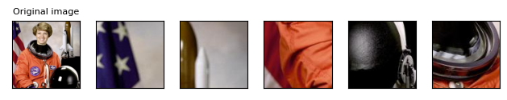
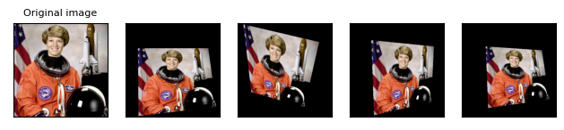
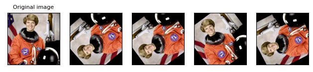
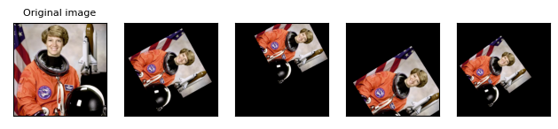
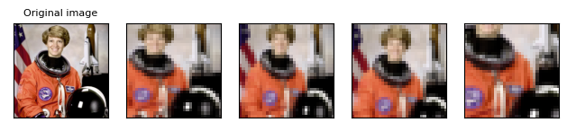
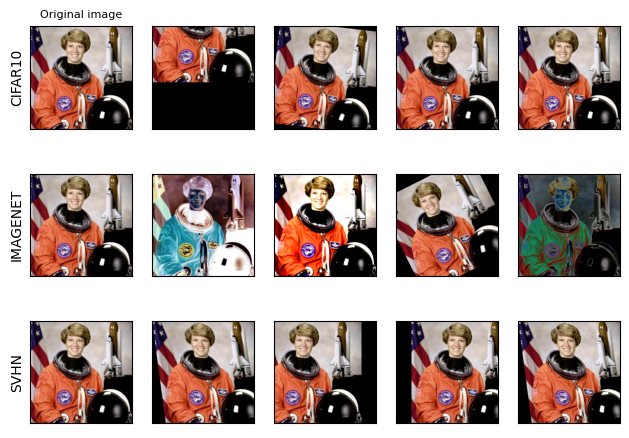
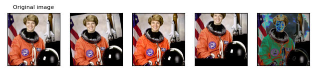
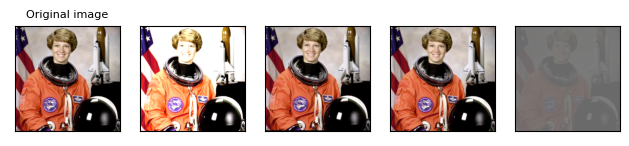
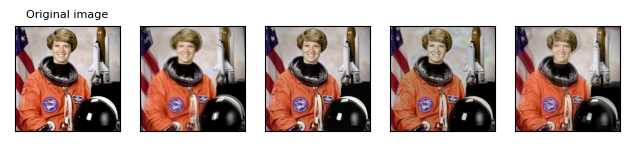
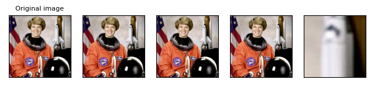

http://pytorch.org/vision/main/auto_examples/plot_transforms.html#sphx-glr-auto-examples-plot-transforms-py

# Illustration of transforms

This example illustrates the various transforms available in [the torchvision.transforms module](http://pytorch.org/vision/main/transforms.html#transforms).

```python
# sphinx_gallery_thumbnail_path = "../../gallery/assets/transforms_thumbnail.png"

from PIL import Image
from pathlib import Path
import matplotlib.pyplot as plt
import numpy as np

import torch
import torchvision.transforms as T


plt.rcParams["savefig.bbox"] = 'tight'
orig_img = Image.open(Path('assets') / 'astronaut.jpg')
# if you change the seed, make sure that the randomly-applied transforms
# properly show that the image can be both transformed and *not* transformed!
torch.manual_seed(0)


def plot(imgs, with_orig=True, row_title=None, **imshow_kwargs):
    if not isinstance(imgs[0], list):
        # Make a 2d grid even if there's just 1 row
        imgs = [imgs]
	
    #一张图片一行
    num_rows = len(imgs)
    num_cols = len(imgs[0]) + with_orig
    fig, axs = plt.subplots(nrows=num_rows, ncols=num_cols, squeeze=False)
    for row_idx, row in enumerate(imgs):
        row = [orig_img] + row if with_orig else row
        for col_idx, img in enumerate(row):
            ax = axs[row_idx, col_idx]
            ax.imshow(np.asarray(img), **imshow_kwargs)
            ax.set(xticklabels=[], yticklabels=[], xticks=[], yticks=[])

    if with_orig:
        axs[0, 0].set(title='Original image')
        axs[0, 0].title.set_size(8)
    if row_title is not None:
        for row_idx in range(num_rows):
            axs[row_idx, 0].set(ylabel=row_title[row_idx])

    plt.tight_layout()
```

## Pad

The [`Pad`](http://pytorch.org/vision/main/generated/torchvision.transforms.Pad.html#torchvision.transforms.Pad) transform (see also [`pad()`](http://pytorch.org/vision/main/generated/torchvision.transforms.functional.pad.html#torchvision.transforms.functional.pad)) fills image borders with some pixel values.

```python
padded_imgs = [T.Pad(padding=padding)(orig_img) for padding in (3, 10, 30, 50)]
plot(padded_imgs)
```


## Resize

The [`Resize`](http://pytorch.org/vision/main/generated/torchvision.transforms.Resize.html#torchvision.transforms.Resize) transform (see also [`resize()`](http://pytorch.org/vision/main/generated/torchvision.transforms.functional.resize.html#torchvision.transforms.functional.resize)) resizes an image.

```python
resized_imgs = [T.Resize(size=size)(orig_img) for size in (30, 50, 100, orig_img.size)]
plot(resized_imgs)
```


## CenterCrop

The [`CenterCrop`](http://pytorch.org/vision/main/generated/torchvision.transforms.CenterCrop.html#torchvision.transforms.CenterCrop) transform (see also [`center_crop()`](http://pytorch.org/vision/main/generated/torchvision.transforms.functional.center_crop.html#torchvision.transforms.functional.center_crop)) crops the given image at the center.

```python
center_crops = [T.CenterCrop(size=size)(orig_img) for size in (30, 50, 100, orig_img.size)]
plot(center_crops)
```


## FiveCrop

The [`FiveCrop`](http://pytorch.org/vision/main/generated/torchvision.transforms.FiveCrop.html#torchvision.transforms.FiveCrop) transform (see also [`five_crop()`](http://pytorch.org/vision/main/generated/torchvision.transforms.functional.five_crop.html#torchvision.transforms.functional.five_crop)) crops the given image into four corners and the central crop.

```python
(top_left, top_right, bottom_left, bottom_right, center) = T.FiveCrop(size=(100, 100))(orig_img)
plot([top_left, top_right, bottom_left, bottom_right, center])
```



## Grayscale

The [`Grayscale`](http://pytorch.org/vision/main/generated/torchvision.transforms.Grayscale.html#torchvision.transforms.Grayscale) transform (see also [`to_grayscale()`](http://pytorch.org/vision/main/generated/torchvision.transforms.functional.to_grayscale.html#torchvision.transforms.functional.to_grayscale)) converts an image to grayscale

```python
gray_img = T.Grayscale()(orig_img)
plot([gray_img], cmap='gray')
```


## Random transforms

The following transforms are random, which means that the same transfomer instance will produce different result each time it transforms a given image.

### ColorJitter

The [`ColorJitter`](http://pytorch.org/vision/main/generated/torchvision.transforms.ColorJitter.html#torchvision.transforms.ColorJitter) transform randomly changes the brightness, saturation, and other properties of an image.

```python
jitter = T.ColorJitter(brightness=.5, hue=.3)
jitted_imgs = [jitter(orig_img) for _ in range(4)]
plot(jitted_imgs)
```


### GaussianBlur

The [`GaussianBlur`](http://pytorch.org/vision/main/generated/torchvision.transforms.GaussianBlur.html#torchvision.transforms.GaussianBlur) transform (see also [`gaussian_blur()`](http://pytorch.org/vision/main/generated/torchvision.transforms.functional.gaussian_blur.html#torchvision.transforms.functional.gaussian_blur)) performs gaussian blur transform on an image.

```python
blurrer = T.GaussianBlur(kernel_size=(5, 9), sigma=(0.1, 5))
blurred_imgs = [blurrer(orig_img) for _ in range(4)]
plot(blurred_imgs)
```


### RandomPerspective

The [`RandomPerspective`](http://pytorch.org/vision/main/generated/torchvision.transforms.RandomPerspective.html#torchvision.transforms.RandomPerspective) transform (see also [`perspective()`](http://pytorch.org/vision/main/generated/torchvision.transforms.functional.perspective.html#torchvision.transforms.functional.perspective)) performs random perspective transform on an image.

```python
perspective_transformer = T.RandomPerspective(distortion_scale=0.6, p=1.0)
perspective_imgs = [perspective_transformer(orig_img) for _ in range(4)]
plot(perspective_imgs)
```



### RandomRotation

The [`RandomRotation`](http://pytorch.org/vision/main/generated/torchvision.transforms.RandomRotation.html#torchvision.transforms.RandomRotation) transform (see also [`rotate()`](http://pytorch.org/vision/main/generated/torchvision.transforms.functional.rotate.html#torchvision.transforms.functional.rotate)) rotates an image with random angle.

```python
rotater = T.RandomRotation(degrees=(0, 180))
rotated_imgs = [rotater(orig_img) for _ in range(4)]
plot(rotated_imgs)
```



### RandomAffine

The [`RandomAffine`](http://pytorch.org/vision/main/generated/torchvision.transforms.RandomAffine.html#torchvision.transforms.RandomAffine) transform (see also [`affine()`](http://pytorch.org/vision/main/generated/torchvision.transforms.functional.affine.html#torchvision.transforms.functional.affine)) performs random affine transform on an image.

```python
affine_transfomer = T.RandomAffine(degrees=(30, 70), translate=(0.1, 0.3), scale=(0.5, 0.75))
affine_imgs = [affine_transfomer(orig_img) for _ in range(4)]
plot(affine_imgs)
```



### RandomCrop

The [`RandomCrop`](http://pytorch.org/vision/main/generated/torchvision.transforms.RandomCrop.html#torchvision.transforms.RandomCrop) transform (see also [`crop()`](http://pytorch.org/vision/main/generated/torchvision.transforms.functional.crop.html#torchvision.transforms.functional.crop)) crops an image at a random location.

```python
cropper = T.RandomCrop(size=(128, 128))
crops = [cropper(orig_img) for _ in range(4)]
plot(crops)
```


### RandomResizedCrop

The [`RandomResizedCrop`](http://pytorch.org/vision/main/generated/torchvision.transforms.RandomResizedCrop.html#torchvision.transforms.RandomResizedCrop) transform (see also [`resized_crop()`](http://pytorch.org/vision/main/generated/torchvision.transforms.functional.resized_crop.html#torchvision.transforms.functional.resized_crop)) crops an image at a random location, and then resizes the crop to a given size.

```python
resize_cropper = T.RandomResizedCrop(size=(32, 32))
resized_crops = [resize_cropper(orig_img) for _ in range(4)]
plot(resized_crops)
```



### RandomInvert

The [`RandomInvert`](http://pytorch.org/vision/main/generated/torchvision.transforms.RandomInvert.html#torchvision.transforms.RandomInvert) transform (see also [`invert()`](http://pytorch.org/vision/main/generated/torchvision.transforms.functional.invert.html#torchvision.transforms.functional.invert)) randomly inverts the colors of the given image.

```python
inverter = T.RandomInvert()
invertered_imgs = [inverter(orig_img) for _ in range(4)]
plot(invertered_imgs)
```


### RandomPosterize

The [`RandomPosterize`](http://pytorch.org/vision/main/generated/torchvision.transforms.RandomPosterize.html#torchvision.transforms.RandomPosterize) transform (see also [`posterize()`](http://pytorch.org/vision/main/generated/torchvision.transforms.functional.posterize.html#torchvision.transforms.functional.posterize)) randomly posterizes the image by reducing the number of bits of each color channel.

```python
posterizer = T.RandomPosterize(bits=2)
posterized_imgs = [posterizer(orig_img) for _ in range(4)]
plot(posterized_imgs)
```


### RandomSolarize

The [`RandomSolarize`](http://pytorch.org/vision/main/generated/torchvision.transforms.RandomSolarize.html#torchvision.transforms.RandomSolarize) transform (see also [`solarize()`](http://pytorch.org/vision/main/generated/torchvision.transforms.functional.solarize.html#torchvision.transforms.functional.solarize)) randomly solarizes the image by inverting all pixel values above the threshold.

```python
solarizer = T.RandomSolarize(threshold=192.0)
solarized_imgs = [solarizer(orig_img) for _ in range(4)]
plot(solarized_imgs)
```


### RandomAdjustSharpness

The [`RandomAdjustSharpness`](http://pytorch.org/vision/main/generated/torchvision.transforms.RandomAdjustSharpness.html#torchvision.transforms.RandomAdjustSharpness) transform (see also [`adjust_sharpness()`](http://pytorch.org/vision/main/generated/torchvision.transforms.functional.adjust_sharpness.html#torchvision.transforms.functional.adjust_sharpness)) randomly adjusts the sharpness of the given image.

```python
sharpness_adjuster = T.RandomAdjustSharpness(sharpness_factor=2)
sharpened_imgs = [sharpness_adjuster(orig_img) for _ in range(4)]
plot(sharpened_imgs)
```


### RandomAutocontrast

The [`RandomAutocontrast`](http://pytorch.org/vision/main/generated/torchvision.transforms.RandomAutocontrast.html#torchvision.transforms.RandomAutocontrast) transform (see also [`autocontrast()`](http://pytorch.org/vision/main/generated/torchvision.transforms.functional.autocontrast.html#torchvision.transforms.functional.autocontrast)) randomly applies autocontrast to the given image.

```python
autocontraster = T.RandomAutocontrast()
autocontrasted_imgs = [autocontraster(orig_img) for _ in range(4)]
plot(autocontrasted_imgs)
```


### RandomEqualize

The [`RandomEqualize`](http://pytorch.org/vision/main/generated/torchvision.transforms.RandomEqualize.html#torchvision.transforms.RandomEqualize) transform (see also [`equalize()`](http://pytorch.org/vision/main/generated/torchvision.transforms.functional.equalize.html#torchvision.transforms.functional.equalize)) randomly equalizes the histogram of the given image.

```python
equalizer = T.RandomEqualize()
equalized_imgs = [equalizer(orig_img) for _ in range(4)]
plot(equalized_imgs)
```


### AutoAugment

The [`AutoAugment`](http://pytorch.org/vision/main/generated/torchvision.transforms.AutoAugment.html#torchvision.transforms.AutoAugment) transform automatically augments data based on a given auto-augmentation policy. See [`AutoAugmentPolicy`](http://pytorch.org/vision/main/generated/torchvision.transforms.AutoAugmentPolicy.html#torchvision.transforms.AutoAugmentPolicy) for the available policies.

```python
policies = [T.AutoAugmentPolicy.CIFAR10, T.AutoAugmentPolicy.IMAGENET, T.AutoAugmentPolicy.SVHN]
augmenters = [T.AutoAugment(policy) for policy in policies]
imgs = [
    [augmenter(orig_img) for _ in range(4)]
    for augmenter in augmenters
]
row_title = [str(policy).split('.')[-1] for policy in policies]
plot(imgs, row_title=row_title)
```



### RandAugment

The [`RandAugment`](http://pytorch.org/vision/main/generated/torchvision.transforms.RandAugment.html#torchvision.transforms.RandAugment) transform automatically augments the data.

```python
augmenter = T.RandAugment()
imgs = [augmenter(orig_img) for _ in range(4)]
plot(imgs)
```



### TrivialAugmentWide

The [`TrivialAugmentWide`](http://pytorch.org/vision/main/generated/torchvision.transforms.TrivialAugmentWide.html#torchvision.transforms.TrivialAugmentWide) transform automatically augments the data.

```python
augmenter = T.TrivialAugmentWide()
imgs = [augmenter(orig_img) for _ in range(4)]
plot(imgs)
```



### AugMix

The [`AugMix`](http://pytorch.org/vision/main/generated/torchvision.transforms.AugMix.html#torchvision.transforms.AugMix) transform automatically augments the data.

```python
augmenter = T.AugMix()
imgs = [augmenter(orig_img) for _ in range(4)]
plot(imgs)
```



## Randomly-applied transforms

Some transforms are randomly-applied given a probability `p`.  That is, the transformed image may actually be the same as the original one, even when called with the same transformer instance!

### RandomHorizontalFlip

The [`RandomHorizontalFlip`](http://pytorch.org/vision/main/generated/torchvision.transforms.RandomHorizontalFlip.html#torchvision.transforms.RandomHorizontalFlip) transform (see also [`hflip()`](http://pytorch.org/vision/main/generated/torchvision.transforms.functional.hflip.html#torchvision.transforms.functional.hflip)) performs horizontal flip of an image, with a given probability.

```python
hflipper = T.RandomHorizontalFlip(p=0.5)
transformed_imgs = [hflipper(orig_img) for _ in range(4)]
plot(transformed_imgs)
```


### RandomVerticalFlip

The [`RandomVerticalFlip`](http://pytorch.org/vision/main/generated/torchvision.transforms.RandomVerticalFlip.html#torchvision.transforms.RandomVerticalFlip) transform (see also [`vflip()`](http://pytorch.org/vision/main/generated/torchvision.transforms.functional.vflip.html#torchvision.transforms.functional.vflip)) performs vertical flip of an image, with a given probability.

```python
vflipper = T.RandomVerticalFlip(p=0.5)
transformed_imgs = [vflipper(orig_img) for _ in range(4)]
plot(transformed_imgs)
```


### RandomApply

The [`RandomApply`](http://pytorch.org/vision/main/generated/torchvision.transforms.RandomApply.html#torchvision.transforms.RandomApply) transform randomly applies a list of transforms, with a given probability.

```python
applier = T.RandomApply(transforms=[T.RandomCrop(size=(64, 64))], p=0.5)
transformed_imgs = [applier(orig_img) for _ in range(4)]
plot(transformed_imgs)
```

