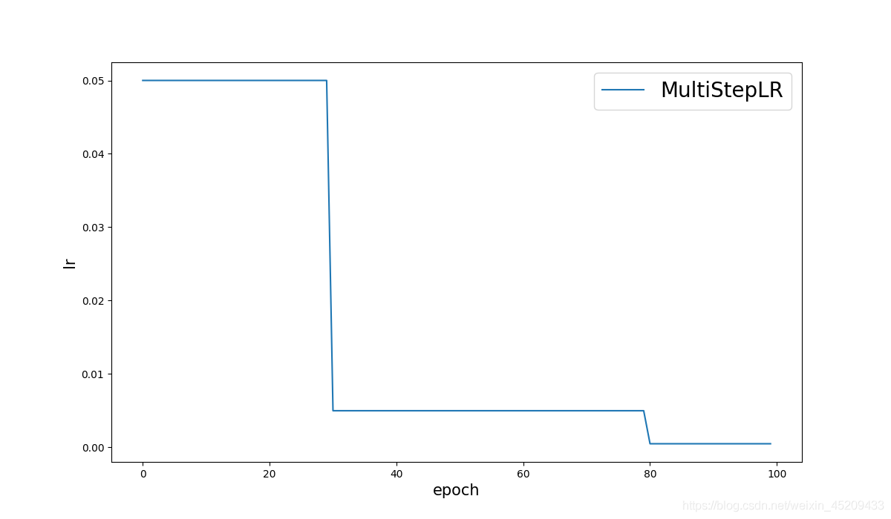
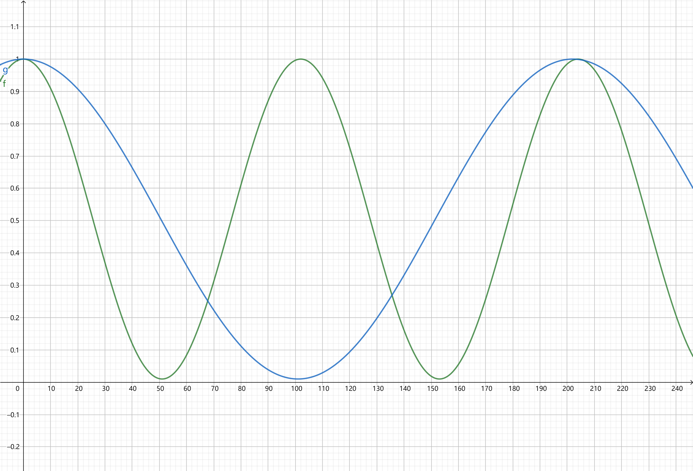
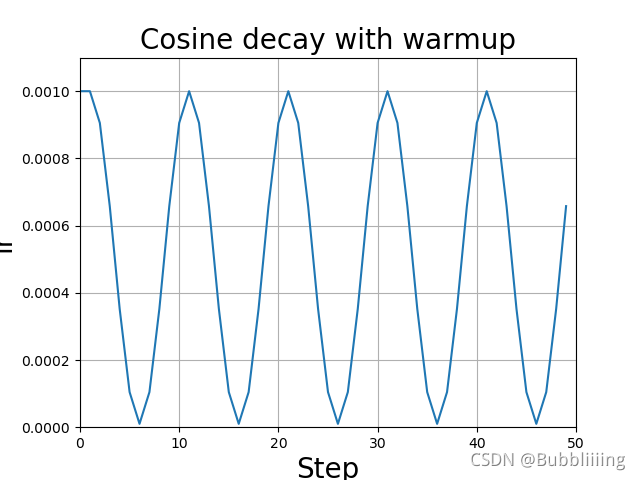
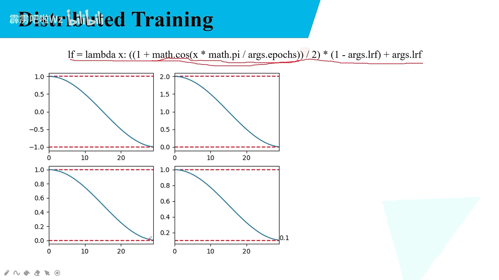

**# torch.optim.lr_scheduler**模块提供了一些根据epoch训练次数来调整学习率（learning rate）的方法。学习率的调整应该是在优化器更新之后。常见的学习率调整策略有几种：

**学习率的调整应该放在optimizer更新之后，下面是一个参考蓝本**

```python
for epoch in range(100):
    train(...)
    validate(...)
    
    scheduler.step()
```

#### 写法1

```python
import torch
from torch import optim
from torchvision import models
from torchvision.models import resnet18


model = resnet18()
optimizer = optim.Adam(model.parameters(), lr=0.005)

# StepLR 按照阶段衰减
#scheduler = optim.lr_scheduler.StepLR(optimizer, step_size=15, gamma=0.1)
scheduler = optim.lr_scheduler.MultiStepLR(optimizer, milestones=[10, 20, 30, 40], gamma=0.1)


for epoch in range(100):
    optimizer.zero_grad()

    print(optimizer.state_dict()['param_groups'][0]['lr'])
    optimizer.step()

    scheduler.step()
```

#### 写法2

```python
import torch
from torch import optim
from torchvision import models
from torchvision.models import resnet18


model = resnet18()
optimizer = optim.Adam(model.parameters(), lr=0.005)

# StepLR 按照阶段衰减
#scheduler = optim.lr_scheduler.StepLR(optimizer, step_size=15, gamma=0.1)
# MultiStepLR 按阶段衰减
scheduler = optim.lr_scheduler.MultiStepLR(optimizer, milestones=[10, 20, 30, 40], gamma=0.1)


def train():
    optimizer.zero_grad()

    print(optimizer.state_dict()['param_groups'][0]['lr'])
    optimizer.step()

    scheduler.step()


for epoch in range(100):
    train()
```


## 1、LambdaLR 学习率 = 初始学习率 * 给定lr_lambda函数的值

> lr_lambda的结果按照epoch调整

> 将每个参数组的学习率设置为初始lr与给定函数的乘积，计算公式是

**new_lr = base_lr * lmbda(self.last_epoch)**

```python
#函数原型
torch.optim.lr_scheduler.LambdaLR(optimizer, lr_lambda, last_epoch=-1, verbose=False)

#使用方法
optimizer = optim.SGD([{'params': net.features.parameters()}, # 默认lr是1e-5
                       {'params': net.classifiter.parameters(), 'lr': 1e-2, "momentum" :0.9,                
                       "weight_decay" :1e-4}],
                      lr=1e-3)

lambda1 = lambda epoch: epoch // 30
lambda2 = lambda epoch: 0.95 ** epoch
scheduler = LambdaLR(optimizer, lr_lambda=[lambda1, lambda2])
```

下图曲线是分别是features和classifiter模块学习率变化曲线
 

## 公式

```python
import torch
from torch.optim import Adam, SGD
from torch.optim import lr_scheduler

# 两个0.01是从噼里啪啦Wz复制过来的
# 学习率最后(最小为) 0.01 * 0.01 = 0.0001
LR = 0.01 # 修改的话直改LR即可,因为是相乘,所以LRF影响不大
LRF = 0.01

# 学习率衰减
optimizer = SGD(pg, lr=LR, momentum=0.9, weight_decay=1E-4)
# Scheduler https://arxiv.org/pdf/1812.01187.pdf
# x 指的是每一轮的epoch,得出的结果乘以学习率
lf = lambda x: ((1 + math.cos(x * math.pi / EPOCHS)) / 2) * (1 - LRF) + LRF  # cosine
scheduler = lr_scheduler.LambdaLR(optimizer, lr_lambda=lf)
```




## ２、MultiplicativeLR

将每个参数组的学习率乘以指定函数中给定的系数，计算公式是：
 **torch.optim.lr_scheduler.MultiplicativeLR(optimizer, lr_lambda, last_epoch=-1, verbose=False)**

```python
#使用方法
lmbda = lambda epoch: 0.95
scheduler = MultiplicativeLR(optimizer, lr_lambda=lmbda)
```

## ３、StepLR 固定步长衰减

`torch.optim.lr_scheduler.StepLR(optimizer, step_size, gamma=0.1, last_epoch=-1, verbose=False)`

```python

#使用方法
# Assuming optimizer uses lr = 0.5 for all groups
# lr = 0.5     if epoch < 30
# lr = 0.05    if 30 <= epoch < 60
# lr = 0.005   if 60 <= epoch < 90
# ...
scheduler = StepLR(optimizer, step_size=30, gamma=0.1)
```

学习率衰减图：
 

## ４、MultiStepLR 多个阶段衰减

`torch.optim.lr_scheduler.MultiStepLR(optimizer, milestones, gamma=0.1, last_epoch=-1, verbose=False)`

```python
# Assuming optimizer uses lr = 0.05 for all groups
# lr = 0.05     if epoch < 30
# lr = 0.005    if 30 <= epoch < 80
# lr = 0.0005   if epoch >= 80
scheduler = MultiStepLR(optimizer, milestones=[30,80], gamma=0.1)
```


## ５、ExponentialLR 指数衰减

每个参数组的学习率按照gamma曲线每个epoch衰减一次

`torch.optim.lr_scheduler.ExponentialLR(optimizer, gamma, last_epoch=-1, verbose=False)`


## ６、ReduceLROnPlateau 读取模型的性能指标

该策略能够读取模型的性能指标，当该指标停止改善时，持续关系几个epochs之后，自动减小学习率。

`torch.optim.lr_scheduler.ReduceLROnPlateau(optimizer, mode='min', factor=0.1, patience=10, threshold=0.0001, threshold_mode='rel', cooldown=0, min_lr=0, eps=1e-08, verbose=False)`

> 参数

- mode（min or max):min指示指标不再减小时降低学习率，max指示指标不再增加时，降低学习率
- factor: new_lr = lr * factor Default: 0.1.
- patience:　观察几个epoch之后降低学习率　Default: 10.

```python
optimizer = torch.optim.SGD(model.parameters(), lr=0.1, momentum=0.9)
scheduler = ReduceLROnPlateau(optimizer, 'min')
```


# 余弦退火衰减

余弦退火衰减法，学习率会先上升再下降，这是退火优化法的思想。（关于什么是退火算法可以百度。）

上升的时候使用线性上升，下降的时候模拟cos函数下降。执行多次。

效果如图所示：



pytorch有直接实现的函数，可直接调用。

```python
# T_max 表示学习率c到达最低的epoch是多少
# eta_min: 最小值
lr_scheduler = optim.lr_scheduler.CosineAnnealingLR(optimizer, T_max=5, eta_min=1e-5)
```


```python
lr_scheduler = optim.lr_scheduler.CosineAnnealingWarmRestarts()
```


```python
lf = lambda x: ((1 + math.cos(x * math.pi / args.epochs)) / 2) * (1 - args.lrf) + args.lrf  # cosine
scheduler = lr_scheduler.LambdaLR(optimizer, lr_lambda=lf)
```



