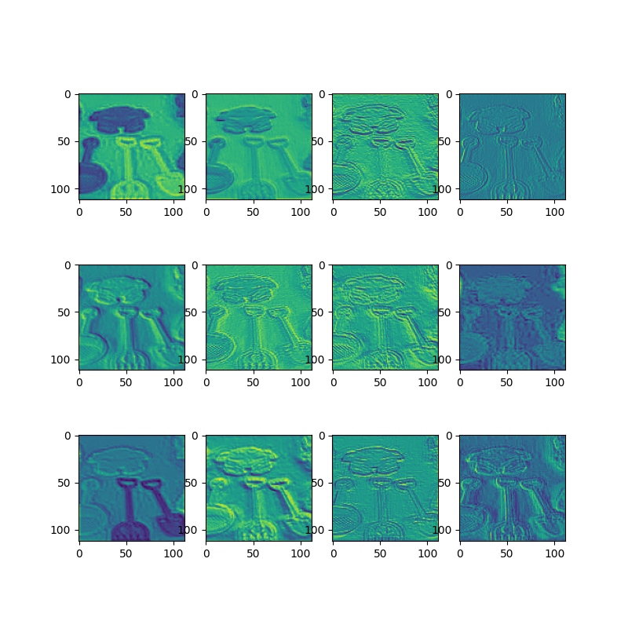
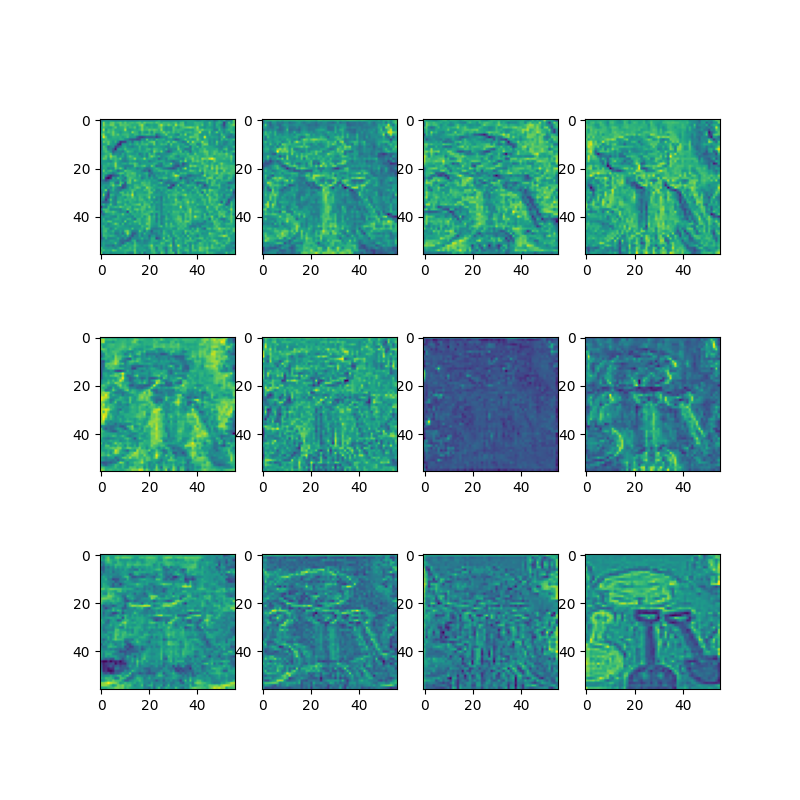
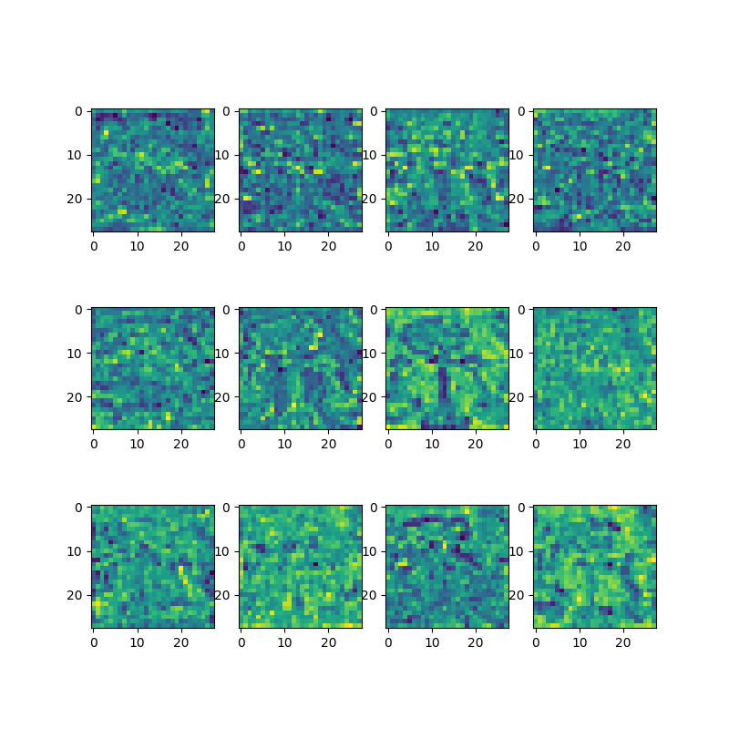
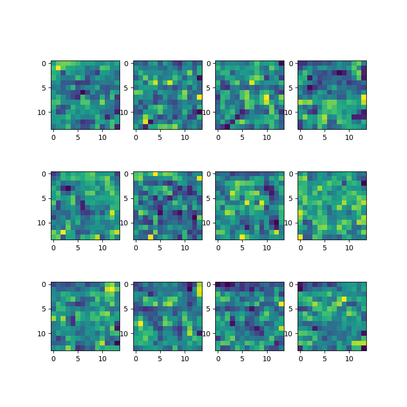
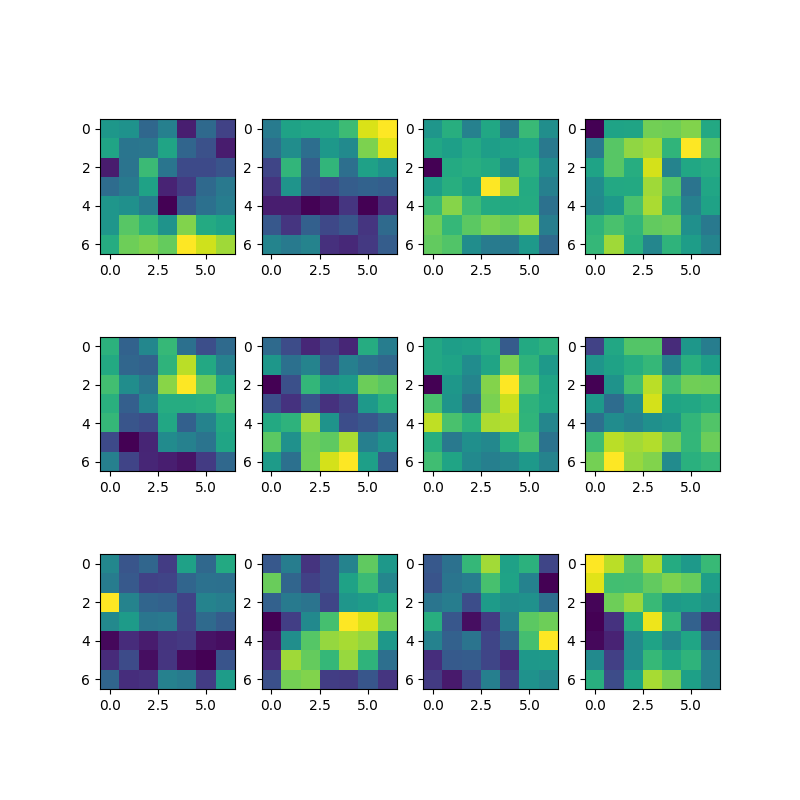
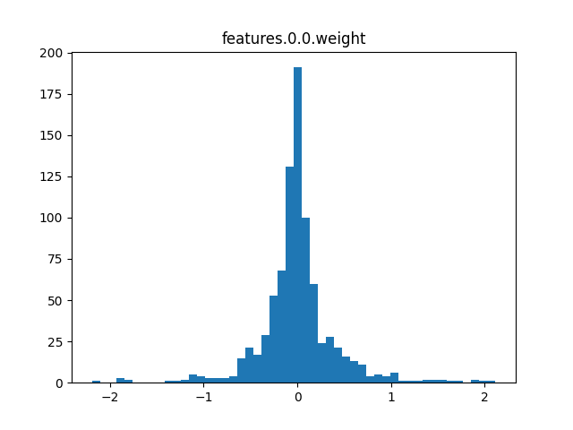
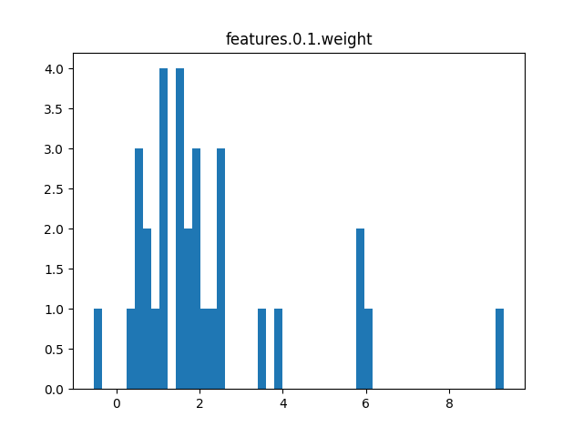

# analyze_feature_map.py 绘制不同特征层处理的图像

```python
#-----------------------------------------------#
#   绘制不同特征层处理的图像
#-----------------------------------------------#

import torch
from efficientnet_v1_00 import efficientnet_b0
import matplotlib.pyplot as plt
import numpy as np
from PIL import Image
from torchvision import transforms

# 预处理
data_transform = transforms.Compose([
            transforms.Resize(int(224*1.25)),
            transforms.RandomCrop((224, 224)),
            transforms.ToTensor(),
            transforms.Normalize([0.485, 0.456, 0.406],
                                [0.229, 0.224, 0.225])
        ])

# create model
model = efficientnet_b0(num_classes=50)
# load model weights
model_weight_path = "./efficientnet_v1_b0_pt_sche_best_model.pkl"
model.load_state_dict(torch.load(model_weight_path))
print(model)

# load image
img = Image.open("./15-0181.jpg")
# [N, C, H, W]
img = data_transform(img)
# expand batch dimension
img = torch.unsqueeze(img, dim=0)

# forward 5次下采样后的最终计算结果
features = model.features
out_put = []
x = features[0:2](img)  # 112
out_put.append(x)
x = features[2:3](x)    # 56
out_put.append(x)
x = features[3:4](x)    # 28
out_put.append(x)
x = features[4:6](x)    # 14
out_put.append(x)
x = features[6:8](x)    # 7
out_put.append(x)


for feature_map in out_put:
    # [N, C, H, W] -> [C, H, W]
    im = np.squeeze(feature_map.detach().numpy())
    # [C, H, W] -> [H, W, C]
    im = np.transpose(im, [1, 2, 0])

    #----------------------------------------------#
    # show top 12 feature maps 显示前12个
    #----------------------------------------------#
    plt.figure(figsize=(8,8), dpi=100)
    for i in range(12):
        ax = plt.subplot(3, 4, i+1) # 3行4列 第i+1张
        # [H, W, C]
        # plt.imshow(im[:, :, i], cmap='gray')  # 灰色
        plt.imshow(im[:, :, i])                 # 蓝绿色
    plt.show()
```

## 5次下采样后的最终计算结果

## features[0:2] 112



## features[2:3] 56



## features[3:4] 28



## features[4:6] 14




## features[6:8] 7




---

# analyze_kernel_weight 获取kernel权重

```python
#-----------------------------------------------#
#   查看模型权重分布
#-----------------------------------------------#

import torch
from efficientnet_v1_00 import efficientnet_b0
import matplotlib.pyplot as plt
import numpy as np


# 直接使用权重即可,不用实例化也没问题
# create model
model = efficientnet_b0(num_classes=50)
# load model weights
model_weight_path = "./efficientnet_v1_b0_pt_sche_best_model.pkl"
model.load_state_dict(torch.load(model_weight_path))
print(model)

# 获取key,通过key获取数据
weights_keys = model.state_dict().keys()
for key in weights_keys:
    # remove num_batches_tracked para(in bn)
    if "num_batches_tracked" in key:
        continue

    # [out_channel,   in_channel,...]
    # [kernel_number, kernel_channel, kernel_height, kernel_width]
    weight_t = model.state_dict()[key].numpy()

    # read a kernel information
    # k = weight_t[0, :, :, :]

    # calculate mean, std, min, max
    weight_mean = weight_t.mean()
    weight_std = weight_t.std(ddof=1)
    weight_min = weight_t.min()
    weight_max = weight_t.max()
    print("mean is {}, std is {}, min is {}, max is {}".format(weight_mean,
                                                               weight_std,
                                                               weight_max,
                                                               weight_min))

    # plot hist image
    plt.close()
    weight_vec = np.reshape(weight_t, [-1]) # 变为一维向量
    plt.hist(weight_vec, bins=50)           # 直方图 bins=50 将数据从小到大分为50份,统计每个区间个数
    plt.title(key)
    plt.show()
```


## features.0.0.weight



## features.0.1.weight

