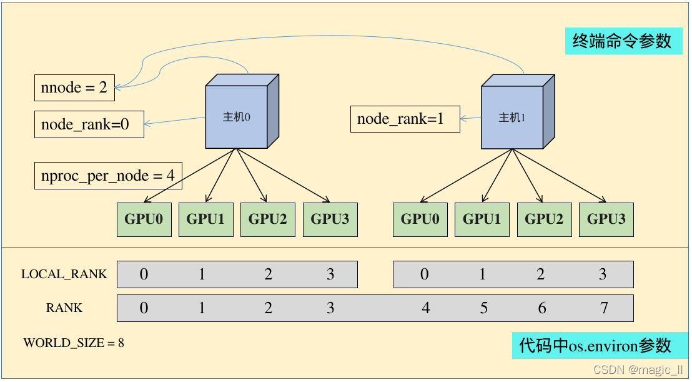
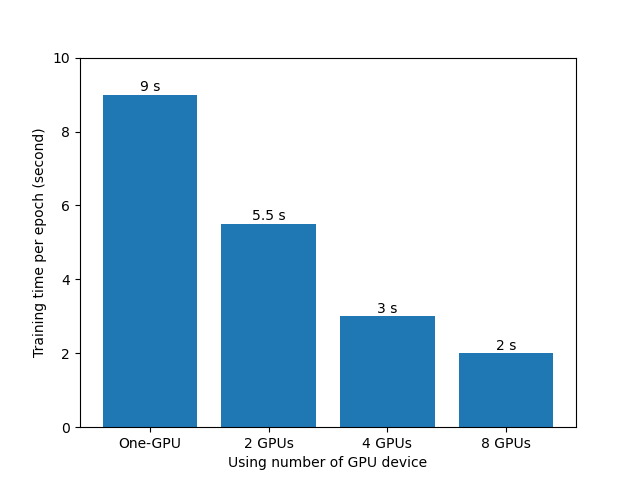
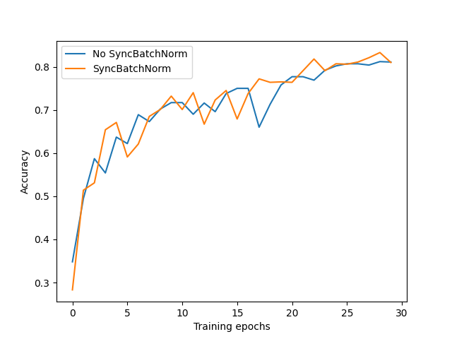
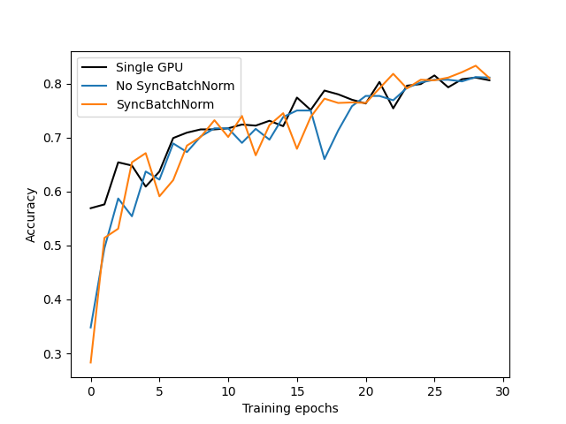

`https://github.com/WZMIAOMIAO/deep-learning-for-image-processing/tree/master/pytorch_classification/train_multi_GPU`

# 多GPU启动指令

## torch.distributed.launch

我们在训练分布式时候，会使用到 `torch.distributed.launch`

`python -m torch.distributed.launch --help`

```sh
NOTE: Redirects are currently not supported in Windows or MacOs.
D:\Anaconda3\envs\ai\lib\site-packages\torch\distributed\launch.py:178: FutureWarning: The module torch.distributed.launch is deprecated
and will be removed in future. Use torchrun.
Note that --use_env is set by default in torchrun.
If your script expects `--local_rank` argument to be set, please
change it to read from `os.environ['LOCAL_RANK']` instead. See
https://pytorch.org/docs/stable/distributed.html#launch-utility for
further instructions

  warnings.warn(
usage: launch.py [-h] [--nnodes NNODES] [--nproc_per_node NPROC_PER_NODE] [--rdzv_backend RDZV_BACKEND]
                 [--rdzv_endpoint RDZV_ENDPOINT] [--rdzv_id RDZV_ID] [--rdzv_conf RDZV_CONF] [--standalone]
                 [--max_restarts MAX_RESTARTS] [--monitor_interval MONITOR_INTERVAL]
                 [--start_method {spawn,fork,forkserver}] [--role ROLE] [-m] [--no_python] [--run_path]
                 [--log_dir LOG_DIR] [-r REDIRECTS] [-t TEE] [--node_rank NODE_RANK] [--master_addr MASTER_ADDR]
                 [--master_port MASTER_PORT] [--use_env]
                 training_script ...

Torch Distributed Elastic Training Launcher

positional arguments:
  training_script       Full path to the (single GPU) training program/script to be launched in parallel, followed by
                        all the arguments for the training script.
  training_script_args

optional arguments:
  -h, --help            show this help message and exit
  --nnodes NNODES       Number of nodes, or the range of nodes in form <minimum_nodes>:<maximum_nodes>.
  --nproc_per_node NPROC_PER_NODE
                        Number of workers per node; supported values: [auto, cpu, gpu, int].
  --rdzv_backend RDZV_BACKEND
                        Rendezvous backend.
  --rdzv_endpoint RDZV_ENDPOINT
                        Rendezvous backend endpoint; usually in form <host>:<port>.
  --rdzv_id RDZV_ID     User-defined group id.
  --rdzv_conf RDZV_CONF
                        Additional rendezvous configuration (<key1>=<value1>,<key2>=<value2>,...).
  --standalone          Start a local standalone rendezvous backend that is represented by a C10d TCP store on port
                        29400. Useful when launching single-node, multi-worker job. If specified --rdzv_backend,
                        --rdzv_endpoint, --rdzv_id are auto-assigned; any explicitly set values are ignored.
  --max_restarts MAX_RESTARTS
                        Maximum number of worker group restarts before failing.
  --monitor_interval MONITOR_INTERVAL
                        Interval, in seconds, to monitor the state of workers.
  --start_method {spawn,fork,forkserver}
                        Multiprocessing start method to use when creating workers.
  --role ROLE           User-defined role for the workers.
  -m, --module          Change each process to interpret the launch script as a Python module, executing with the same
                        behavior as 'python -m'.
  --no_python           Skip prepending the training script with 'python' - just execute it directly. Useful when the
                        script is not a Python script.
  --run_path            Run the training script with runpy.run_path in the same interpreter. Script must be provided
                        as an abs path (e.g. /abs/path/script.py). Takes precedence over --no_python.
  --log_dir LOG_DIR     Base directory to use for log files (e.g. /var/log/torch/elastic). The same directory is re-
                        used for multiple runs (a unique job-level sub-directory is created with rdzv_id as the
                        prefix).
  -r REDIRECTS, --redirects REDIRECTS
                        Redirect std streams into a log file in the log directory (e.g. [-r 3] redirects both
                        stdout+stderr for all workers, [-r 0:1,1:2] redirects stdout for local rank 0 and stderr for
                        local rank 1).
  -t TEE, --tee TEE     Tee std streams into a log file and also to console (see --redirects for format).
  --node_rank NODE_RANK
                        Rank of the node for multi-node distributed training.
  --master_addr MASTER_ADDR
                        Address of the master node (rank 0). It should be either the IP address or the hostname of
                        rank 0. For single node multi-proc training the --master_addr can simply be 127.0.0.1; IPv6
                        should have the pattern `[0:0:0:0:0:0:0:1]`.
  --master_port MASTER_PORT
                        Port on the master node (rank 0) to be used for communication during distributed training.
  --use_env             Use environment variable to pass 'local rank'. For legacy reasons, the default value is False.
                        If set to True, the script will not pass --local_rank as argument, and will instead set
                        LOCAL_RANK.
```

> torch.ditributed.launch参数解析（终端运行命令的参数）：

- `--nnodes` ：              节点的数量，通常一个节点对应一个主机，方便记忆，直接表述为主机
  - `--nnodes=1:3` ： 表示当前训练任务接受最少1个node，最多3个node参与分布式训练
- `--node_rank`：         节点的序号，从0开始
- `--nproc_per_node`：一个节点中显卡的数量

- `--master_addr`：      master节点的ip地址，也就是0号主机的IP地址，该参数是为了让 其他节点 知道0号节点的位，来将自己训练的参数传送过去处理

- `--master_port`：      master节点的port号，在不同的节点上master_addr和master_port的设置是一样的，用来进行通信

- `--max_restarts=3`:   worker group最大的重启次数；这里需要注意的是，node fail、node scale down和node scale up都会导致restart
- `--rdzv_id=1`：          一个unique的job id，所有node均使用同一个job id
- `--rdzv_backend`:       endezvous的backend实现，默认支持c10d和etcd两种；rendezvous用于多个node之间的通信和协调
- `--rdzv_endpoint`：   rendezvous的地址，应该为一个node的host ip和port,like `--rdzv_endpoint='192.168.1.2:29400'`

> torch.ditributed.launch相关环境变量解析（代码中os.environ中的参数）：

- `WORLD_SIZE`： os.environ[“WORLD_SIZE”] 每张显卡在自己主机中的序号，从0开始
- `LOCAL_RANK`： os.environ[“LOCAL_RANK”] 所有进程的数量
- `RANK`：            os.environ[“RANK”] 进程的序号，一般是1个gpu对应一个进程



> 单机多卡

- 如果要使用 `train_multi_gpu_using_launch.py` 脚本，使用以下指令启动

  ```sh
  python -m torch.distributed.launch --nproc_per_node=8 --use_env train_multi_gpu_using_launch.py
  ```

- 如果要指定使用某几块GPU可使用如下指令，例如使用第1块和第4块GPU进行训练

  ```shell
  CUDA_VISIBLE_DEVICES=0,3 python -m torch.distributed.launch --use_env --nproc_per_node=2 train_multi_gpu_using_launch.py
  # 指定端口，为了一台设备同时执行多个训练
  CUDA_VISIBLE_DEVICES=0,1 python -m torch.distributed.launch --use_env --nproc_per_node=2 --rdzv_id=1 --rdzv_backend=c10d --rdzv_endpoint='127.0.0.1:29400' train_multi_gpu_using_launch.py
  ```

- 如果要使用 `train_multi_gpu_using_spawn.py` 脚本，使用以下指令启动

  ```sh
  python train_multi_gpu_using_spawn.py
  ```

> 多机多卡

- 在0号机器上调用

  ```sh
  python -m torch.distributed.launch --nproc_per_node=8 --nnodes=2 --node_rank=0 --master_addr='192.168.1.2' --master_port='29500' train_multi_GPU.py
  ```

- 在1号机器上调用

  ```sh
  python -m torch.distributed.launch --nproc_per_node=8 --nnodes=2 --node_rank=1 --master_addr='192.168.1.2' --master_port='29500' train_multi_GPU.py
  ```

注意:

- 命令中的【master_addr=‘172.18.39.122’】指的是0号机器的IP，在0号机器上运行的命令中【node_rank】必须为0
- 只有当【nnodes】个机器全部运行，代码才会进行分布式的训练操作，否则一直处于等待状态

---

## torchrun

> 1.10 更新了torchrun命令
>
> torchrun 包含了torch.distributed.launch的所有功能，还有以下三点额外的功能：

1. worker的rank和world_size将被自动分配 
2. 通过重新启动所有workers来处理workers的故障 
3. 允许节点数目在最大最小值之间有所改变 即具备弹性

`torchrun --help`

```sh
NOTE: Redirects are currently not supported in Windows or MacOs.
usage: torchrun [-h] [--nnodes NNODES] [--nproc_per_node NPROC_PER_NODE] [--rdzv_backend RDZV_BACKEND]
                [--rdzv_endpoint RDZV_ENDPOINT] [--rdzv_id RDZV_ID] [--rdzv_conf RDZV_CONF] [--standalone]
                [--max_restarts MAX_RESTARTS] [--monitor_interval MONITOR_INTERVAL]
                [--start_method {spawn,fork,forkserver}] [--role ROLE] [-m] [--no_python] [--run_path]
                [--log_dir LOG_DIR] [-r REDIRECTS] [-t TEE] [--node_rank NODE_RANK] [--master_addr MASTER_ADDR]
                [--master_port MASTER_PORT]
                training_script ...

Torch Distributed Elastic Training Launcher

positional arguments:
  training_script       Full path to the (single GPU) training program/script to be launched in parallel, followed by
                        all the arguments for the training script.
  training_script_args

optional arguments:
  -h, --help            show this help message and exit
  --nnodes NNODES       Number of nodes, or the range of nodes in form <minimum_nodes>:<maximum_nodes>.
  --nproc_per_node NPROC_PER_NODE
                        Number of workers per node; supported values: [auto, cpu, gpu, int].
  --rdzv_backend RDZV_BACKEND
                        Rendezvous backend.
  --rdzv_endpoint RDZV_ENDPOINT
                        Rendezvous backend endpoint; usually in form <host>:<port>.
  --rdzv_id RDZV_ID     User-defined group id.
  --rdzv_conf RDZV_CONF
                        Additional rendezvous configuration (<key1>=<value1>,<key2>=<value2>,...).
  --standalone          Start a local standalone rendezvous backend that is represented by a C10d TCP store on port
                        29400. Useful when launching single-node, multi-worker job. If specified --rdzv_backend,
                        --rdzv_endpoint, --rdzv_id are auto-assigned; any explicitly set values are ignored.
  --max_restarts MAX_RESTARTS
                        Maximum number of worker group restarts before failing.
  --monitor_interval MONITOR_INTERVAL
                        Interval, in seconds, to monitor the state of workers.
  --start_method {spawn,fork,forkserver}
                        Multiprocessing start method to use when creating workers.
  --role ROLE           User-defined role for the workers.
  -m, --module          Change each process to interpret the launch script as a Python module, executing with the same
                        behavior as 'python -m'.
  --no_python           Skip prepending the training script with 'python' - just execute it directly. Useful when the
                        script is not a Python script.
  --run_path            Run the training script with runpy.run_path in the same interpreter. Script must be provided
                        as an abs path (e.g. /abs/path/script.py). Takes precedence over --no_python.
  --log_dir LOG_DIR     Base directory to use for log files (e.g. /var/log/torch/elastic). The same directory is re-
                        used for multiple runs (a unique job-level sub-directory is created with rdzv_id as the prefix).
  -r REDIRECTS, --redirects REDIRECTS
                        Redirect std streams into a log file in the log directory (e.g. [-r 3] redirects both
                        stdout+stderr for all workers, [-r 0:1,1:2] redirects stdout for local rank 0 and stderr for local rank 1).
  -t TEE, --tee TEE     Tee std streams into a log file and also to console (see --redirects for format).
  --node_rank NODE_RANK
                        Rank of the node for multi-node distributed training.
  --master_addr MASTER_ADDR
                        Address of the master node (rank 0). It should be either the IP address or the hostname of
                        rank 0. For single node multi-proc training the --master_addr can simply be 127.0.0.1; IPv6
                        should have the pattern `[0:0:0:0:0:0:0:1]`.
  --master_port MASTER_PORT
                        Port on the master node (rank 0) to be used for communication during distributed training.
```

- `--nnodes` ：              节点的数量，通常一个节点对应一个主机，方便记忆，直接表述为主机
  - `--nnodes=1:3` ： 表示当前训练任务接受最少1个node，最多3个node参与分布式训练
- `--node_rank`：         节点的序号，从0开始
- `--nproc_per_node`：一个节点中显卡的数量

- `--master_addr`：      master节点的ip地址，也就是0号主机的IP地址，该参数是为了让 其他节点 知道0号节点的位，来将自己训练的参数传送过去处理

- `--master_port`：      master节点的port号，在不同的节点上master_addr和master_port的设置是一样的，用来进行通信

- `--max_restarts=3`:   worker group最大的重启次数；这里需要注意的是，node fail、node scale down和node scale up都会导致restart
- `--rdzv_id=1`：          一个unique的job id，所有node均使用同一个job id
- `--rdzv_backend`:       endezvous的backend实现，默认支持c10d和etcd两种；rendezvous用于多个node之间的通信和协调
- `--rdzv_endpoint`：   rendezvous的地址，应该为一个node的host ip和port,like `--rdzv_endpoint='192.168.1.2:29400'`

> 单机多卡训练

* 多GPU训练

  ```sh
  torchrun --nproc_per_node=8 train_multi_gpu_using_launch.py
  ```

* 如果想指定使用哪些GPU设备可在指令前加上```CUDA_VISIBLE_DEVICES=0,1```(例如我只要使用设备中的第1块和第4块GPU设备)

  ```sh
  CUDA_VISIBLE_DEVICES=0,1 torchrun --nproc_per_node=2 train_multi_gpu_using_launch.py
  # 指定端口，为了一台设备同时执行多个训练
  CUDA_VISIBLE_DEVICES=0,1 torchrun --nproc_per_node=2 --rdzv_id=1 --rdzv_backend=c10d --rdzv_endpoint='127.0.0.1:29400'  train_multi_gpu_using_launch.py
  ```

> 多机多卡

- 在0号机器上调用

  ```sh
  torchrun --nproc_per_node=8 --nnodes=1:2 --node_rank=0 --max_restarts=3 --rdzv_id=1 --rdzv_backend=c10d --rdzv_endpoint='192.168.1.2:29400' train_multi_GPU.py
  ```

- 在1号机器上调用

  ```sh
  torchrun --nproc_per_node=8 --nnodes=1:2 --node_rank=1 --max_restarts=3 --rdzv_id=1 --rdzv_backend=c10d --rdzv_endpoint='192.168.1.2:29400' train_multi_GPU.py
  ```

-----

# 训练时间对比



# 是否使用SyncBatchNorm



# 单GPU与多GPU训练曲线



# 其它

[实操教程｜Pytorch - 弹性训练极简实现( 附源码)](https://blog.csdn.net/qq_29462849/article/details/124335800)

[Pytorch DDP分布式训练介绍](https://zhuanlan.zhihu.com/p/453798093)
