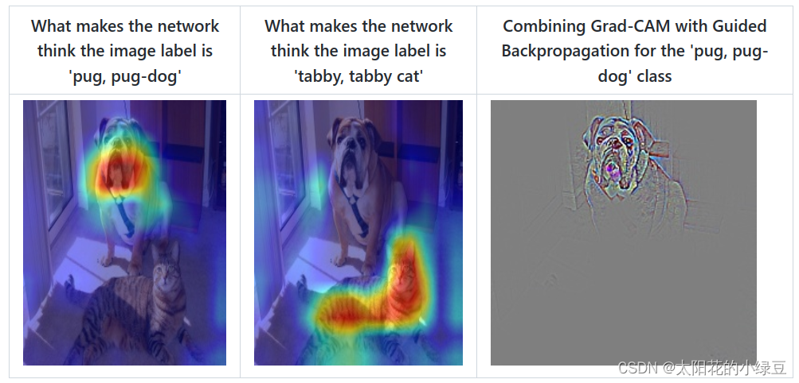
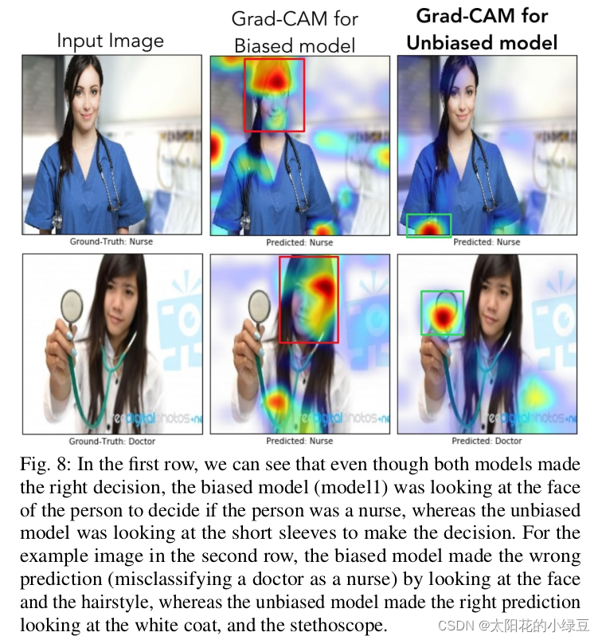
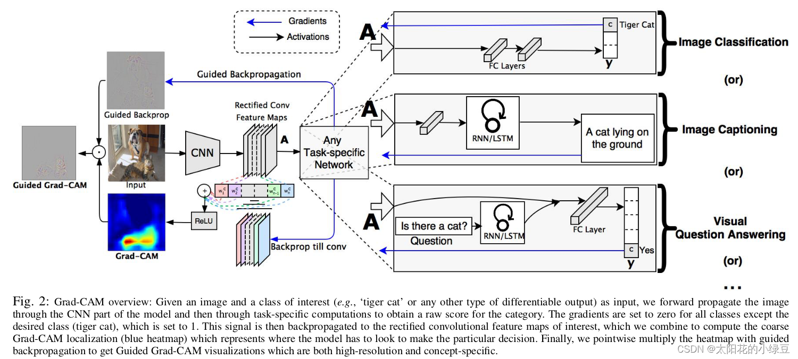
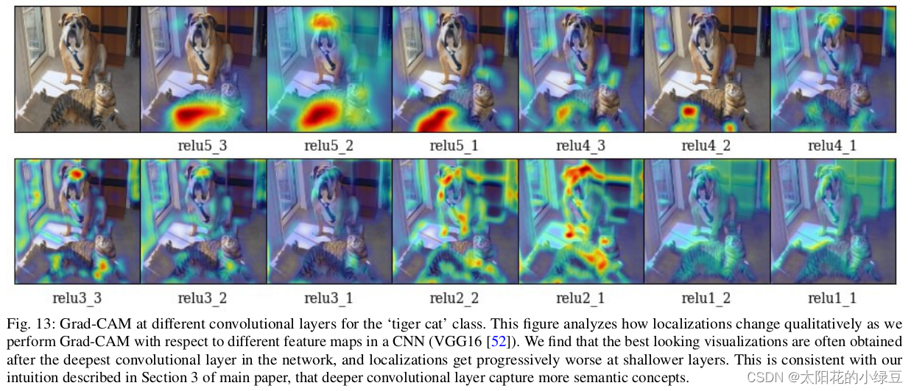
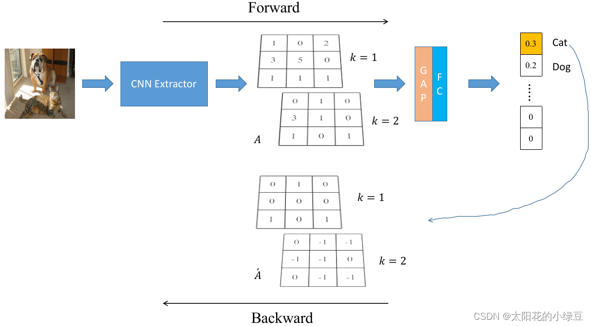
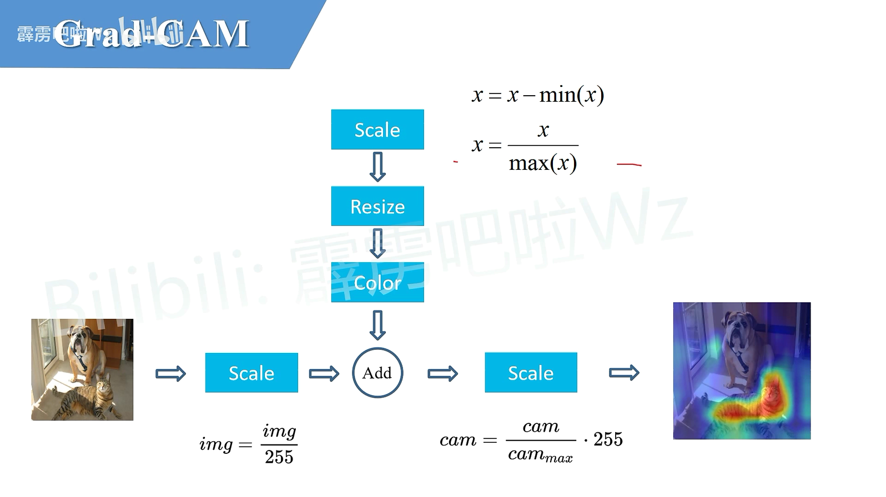
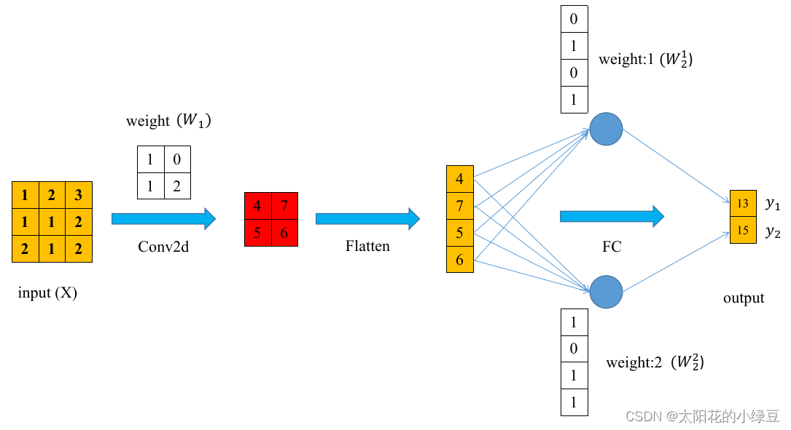
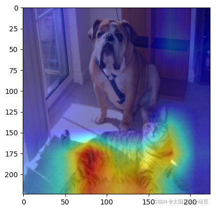

https://blog.csdn.net/qq_37541097/article/details/123089851


`∂x` 求x的偏导

# 0 前言


对于常用的深度学习网络（例如CNN），普遍认为是个黑盒可解释性并不强（至少现在是这么认为的），它为什么会这么预测，它关注的点在哪里，我们并不知道。很多科研人员想方设法地去探究其内在的联系，也有很多相关的论文。今天本文简单聊一聊Grad-CAM，这并不是一篇新的文章，但很有参考意义。通过Grad-CAM我们能够绘制出如下的热力图（对应给定类别，网络到底关注哪些区域）。Grad-CAM(Gradient-weighted  Class Activation Mapping)是CAM(Class Activation Mapping)的升级版（论文3.1节中给出了详细的证明），Grad-CAM相比与CAM更具一般性。CAM比较致命的问题是需要修改网络结构并且重新训练，而Grad-CAM完美避开了这些问题。本文不对CAM进行讲解，有兴趣的小伙伴自行了解。



刚刚提到Grad-CAM能够帮我们分析网络对于某个类别的关注区域，那么我们通过网络关注的区域能够反过来分析网络是否学习到正确的特征或者信息。在论文6.3章节中举了个非常有意思的例子，作者训练了一个二分类网络，Nurse和Doctor。如下图所示，第一列是预测时输入的原图，第二列是Biased model（具有偏见的模型）通过Grad-CAM绘制的热力图。第三列是Unbiased model（不具偏见的模型）通过Grad-CAM绘制的热力图。通过对比发现，Biased model对于Nurse（护士）这个类别关注的是人的性别，可能模型认为Nurse都是女性，很明显这是带有偏见的。比如第二行第二列这个图，明明是个女Doctor（医生），但Biased model却认为她是Nurse（因为模型关注到这是个女性）。而Unbiased model关注的是Nurse和Doctor使用的工作器具以及服装，明显这更合理。



# 1 Grad-CAM介绍以及实验

### 1.1 理论介绍

作者的想法还是比较简单的，参见下图。这里我们简单看下`Image Classification`任务，首先网络进行正向传播，得特征层 $A$ 一般指的是最后一个卷积层的输出）和网络预测值 $y$（注意，这里指的是softmax激活之前的数值）。假设我们想看下网络针对`Tiger Cat`这个类别的感兴趣区域，假设网络针对Tiger Cat类别的预测值为 $y^c$。接着对 $y^c$ 进行反向传播，能够得到反传回特征层 $A$ 的梯度信息 $\acute{A}$。通过计算得到针对特征层 $A$ 每个通道的重要程度，然后进行加权求和通过 $ReLU$ 就行了，最终得到的结果即是Grad-CAM。



至于为什么要这么做，我这里讲下我个人的观点（若有不对请指出）。首先得到的特征层 $A$ 是网络对原图进行特征提取得到的结果，越往后的特征层抽象程度越高，语义信息越丰富，而且利用CNN抽取得到的特征图是能够保留空间信息的（Transformer同样）。所以Grad-CAM在CNN中一般 $A$ 都指的是最后一个卷积层的输出（参考下图实验，越往后的特征层效果越好）。当然特征层 $A$ 包含了所有我们感兴趣目标的语义信息，但具体哪些语义信息对应哪个类别我们并不清楚。接着通过对类别 $c$ 的预测值 $y^c$ 进行反向传播，得到反传回特征层 $A$ 的梯度信息 $\acute{A}$，那么 $\acute{A}$ 就是 $y^c$ 对 $A$ 求得的偏导，换句话说， $\acute{A}$ 代表 $A$ 中每个元素对 $y^c$ 的贡献，贡献越大网络就认为越重要。然后对 $\acute{A}$ 在 $w, h$ 上求均值就能得到针对 $A$ 每个通道的重要程度（这里是对于类别 $c$ 而言的）。最后进行简单的加权求和在通过 $ReLU$ 就能得到文中所说的Grad-CAM。



> 关于Grad-CAM总结下来就是下面这个公式：
>
> **权重*数据的总和然后通过relu激活函数**

$$
L_{Grad−CAM}^c = ReLU(\sum_k a_k^c A^k) \quad (1)
$$
> 其中:

- **$A$ 代表某个特征层，在论文中一般指的是最后一个卷积层输出的特征层**
- **$k$ 代表特征层 $A$ 中第 $k$ 个通道(channel)**
- **$c$ 代表类别 $c$**
- **$A^k$ 代表特征层 $A$ 中通道 $k$ 的数据**
- **$α_k^c$ 代表针对 $A^k$ 的权重**

> 关于 $\alpha_k^c$ 的计算公式如下：
>
> 求均值操作
>
> **两个求和中 i j 可以理解为宽高,最终求全图总和,最后除以个数得到这个通道中数据的均值**
>
> **求出来的是权重**

$$
\alpha_k^c = \frac 1 Z \sum_i \sum_j \frac {∂y^c} {∂A_{ij}^k} \quad (2)
$$
> 其中：

- **$y^c$ 代表网络针对类别 $c$ 预测的分数(score)，注意这里没有通过softmax激活**
- **$A_{ij}^k$ 代表特征层 A 在通道 k 中，坐标为 $ij$ 位置处的数据**
- **$Z$ 等于特征层的宽度 $\times$ 高度**

> 通过计算公式(2)可知 $\alpha_k^c$ 就是通过预测类别 $c$ 的预测分数 $y^c$ 进行反向传播，然后利用反传到特征层 $A$ 上的梯度信息计算特征层                              $A$每个通道$k$的重要程度。接着通过 $\alpha$ 对特征层 $A$ 每个通道的数据进行加权求和，最后通过 $ReLU$ 激活函数得到Grad-CAM（论文中说使用 $ReLU$ 是为了过滤掉`Negative pixles`，而`Negative pixles`很可能是归属于其他类别的`pixles`）。当然一般还要通过一些后处理，插值等方法与原图叠加得到最终的可视化结果。

> 光说公式没意思，这里举个例子，下图中CNN Extractor代表CNN特征提取器，GAP代表Global Average Pooling，FC代表全连接层：



> 假设网络正向传播得到的特征层 $A$ 如图所示示（这里为了方便只画了两个channel，数据都是随便写的不必深究），针对类别Cat的预测值进行反向传播得到针对特征层 $A$ 的梯度信息 $\acute{A}$ (关于梯度是如何计算的，可以参考本文1.2和1.3的内容)，接着利用上述提到的公式(2)计算针对特征层 $A$ 每个通道的权重，就是求 $\acute{A}$ 每个通道的均值。
>
>  $α_k^c$就是求通道的均值

$$
α_k^c = \frac 1 Z \sum_i \sum_j \frac {∂y^c} {∂A_{ij}^k} \quad (2)
$$
> 那么有两个通道的均值为：
>
> **求出来的是权重**

$$
α^{Cat} = 
\begin{pmatrix}
α_1^{Cat}
 \\
α_2^{Cat}
\end{pmatrix}
=
\begin{pmatrix}
\frac 1 3
 \\
- \frac 2 3
\end{pmatrix}
$$
> 然后我们再带入公式(1):
>
> **权重*数据的总和然后通过relu激活函数**

$$
L_{Grad−CAM}^c = ReLU(\sum_k α_k^c A^k) \quad (1)
$$
> 得到对应类别Cat的Grad-CAM：
>
> **结果是一个单通道的数据,要通过后处理和原图堆叠**

$$
L_{Grad−CAM}^{Cat} = ReLU(

\frac 1 3
⋅
\begin{pmatrix}
1 & 0 & 2 \\
3 & 5 & 0 \\
1 & 1 & 1
\end{pmatrix}
+
(- \frac 2 3)
⋅
\begin{pmatrix}
0 & 1 & 0 \\
3 & 1 & 0 \\
1 & 0 & 1
\end{pmatrix}
)
=
ReLU(
\begin{pmatrix}
\frac 1 3 & -\frac 2 3 & \frac 2 3 \\
-1 & 1 & 0 \\
-\frac 1 3 & \frac 1 3 & -\frac 1 3 
\end{pmatrix}
)
=
\begin{pmatrix}
\frac 1 3 & 0 & \frac 2 3 \\
0 & 1 & 0 \\
0 & \frac 1 3 & 0 
\end{pmatrix}
$$

> 后处理
>
> 左边是原图, 上面是得到的权重
>
> 原图要归一化
>
> 权重减去最小值,除以最大值变为0~1之间, resize变化为原图大小, 转化为彩色图片(0为蓝色 255为红色)
>
> 相加之后除以最大值变为0~1之间, 最后乘以255




### 1.2 梯度计算示例

上面在介绍计算Grad-CAM时，其实主要是计算正向传播得到的特征层 $A$，和反向传播得到的 $ \acute{A}$，得到特征层 $A$ 很简单，大家也经常会提取某个特征层进行分析或者特征融合等等。但获取 $\acute{A}$ 会相对麻烦点，计算倒不是难点因为常用的深度学习框架都会自动帮我们计算，只是很少有人会使用到反传的梯度信息。那 $\acute{A}$ 究竟要怎么去计算，如果大家有兴趣的话可以看下下面的例子，不感兴趣的话可以直接跳过。

下面构建了一个非常简单的神经网络，主要结构就是一个卷积层 + 一个全连接层，通过这个简单的例子来演示如何计算反向传播过程中某个特征层的梯度。



根据上图，可得output第一个元素的计算公式如下：
$$
y_1 = f_{fc}(f_{conv2d}(X,W_1),W_2^1)
$$
其中，$X$ 代表输入（input），$f_{conv2d}$ 表示卷积层的计算， $f_{fc}$ 表示全连接层的计算，$W_1$代表卷积层对应的权重（为了方便，这里都不考虑偏执bias）， $W_2^1$ 代表全连接层中第一个节点对应的权重。

这里先令 $f_{conv2d}(X, W_1)$ 即卷积层输出的结果为 $O=(O_{11},O_{12},O_{21},O_{22})^T$（为了方便后续计算，这里直接展平写成向量形式）分别对应图中的 $(4, 7, 5, 6)^T$，注意这里的 $O$ 并不是标量，是向量，那么 $y_1$ 的计算公式为：
$$
y_1 = f_{fc}(O,W_2^1)=O_{11} ⋅ W_2^{11} + O_{12} ⋅ W_2^{12} + O_{21} ⋅ W_2^{13} + O_{22} ⋅ W_2^{14}
$$
接着对 $O$ 求偏导：
$$
\frac {∂y_1} {∂O} = \frac {∂y_1} {∂(O_{11}, O_{12}, O_{21}, O_{22})^T}
=
(W_2^{11}, W_2^{12}, W_2^{13}, W_2^{14})^T
=
(0,1,0,1)^T
$$
将 $\frac{\partial y_1}{\partial O}$ 得到的结果进行reshape一下得到（后面有使用Pytorch进行的实验，结果是一致的）：
$$
\begin{pmatrix}
0 & 1 \\
0 & 1 \\
\end{pmatrix}
$$
**看官请留步，后面是选看内容，不想看的可以直接跳到Pytorch实验部分**

如果想进一步求 $y_1$ 对输入 $X$ 的偏导，即 $\frac{\partial y_1}{\partial X}$。 $X\to O\to y_1$，这里需要稍微注意下， $y_1$ 是标量，$O$ 和 $X$ 是向量（为了方便理解，这里将矩阵展平成向量）。根据链式法则以及雅克比矩阵的传递性得（参考的https://github.com/soloice/Matrix_Derivatives内容）：
$$
\frac {∂Y} {∂X} = \frac {∂Y} {∂O} ⋅ \frac {∂O} {∂X}
$$
再根据 $Y$（向量）退化成标量时雅克比矩阵和函数导数的关系有：
$$
\frac {∂Y} {∂X}  = \frac {∂y_1} {∂X^T}, \quad   \frac {∂Y} {∂O} = \frac {∂y_1} {∂O^T}
$$
再带入上式得（此公式是把导数视为行向量）：
$$
\frac {∂y_1} {∂X^T} = \frac {∂y_1} {∂O^T} ⋅ \frac {∂O} {∂X}
$$
前面已经计算出了 $\frac{\partial y_1}{\partial O}$ ，那么 $\frac{\partial y_1}{\partial O^T}$ 转置下即可。接下来就是要求解 $\frac{\partial O}{\partial X}$:
$$
\frac {∂O} {∂X} = 
\frac 
{∂(O_{11}, O_{12}, O_{21}, O_{22})^T}
{∂(X_{11}, X_{12}, X_{13} ,...,X_{31}, X_{32}, X_{33})^T}
$$
对应的雅克比矩阵（Jacobian matrix）为一个$4 \times 9$ 大小的矩阵：
$$
\begin{pmatrix}
\frac {∂O_{11}} {∂X_{11}} & \frac {∂O_{11}} {∂X_{12}} & \frac {∂O_{11}} {∂X_{13}} \quad ... & \frac {∂O_{11}} {∂X_{32}} & \frac {∂O_{11}} {∂X_{33}} \\

\frac {∂O_{12}} {∂X_{11}} & \frac {∂O_{12}} {∂X_{12}} & \frac {∂O_{12}} {∂X_{13}} \quad ... & \frac {∂O_{12}} {∂X_{32}} & \frac {∂O_{12}} {∂X_{33}} \\

\frac {∂O_{21}} {∂X_{11}} & \frac {∂O_{21}} {∂X_{12}} & \frac {∂O_{21}} {∂X_{13}} \quad ... & \frac {∂O_{21}} {∂X_{32}} & \frac {∂O_{21}} {∂X_{33}} \\

\frac {∂O_{22}} {∂X_{11}} & \frac {∂O_{22}} {∂X_{12}} & \frac {∂O_{22}} {∂X_{13}} \quad ... & \frac {∂O_{22}} {∂X_{32}} & \frac {∂O_{22}} {∂X_{33}}
\end{pmatrix}
$$
比如说对于 $O_{11}$，是通过 $W_1$与 $X$ 左上角的 $2\times2$ 窗口进行加权求和得到的，即:
$$
O_{11} = X_{11} ⋅ W_1^{11} + X_{12} ⋅ W_1^{12} + X_{21} ⋅ W_1^{21} + X_{22} ⋅ W_1^{22}
$$

通过上面公式可得 $O_{11}$ 只和$X_{11}，X_{12}，X_{21}，X_{22} $有关，故其他的偏导数都为0）：
$$
\frac {∂O_{11}} {∂X_{11}},\frac {∂O_{11}} {∂X_{12}},\frac {∂O_{11}} {∂X_{13}},...,
\frac {∂O_{11}} {∂X_{32}},\frac {∂O_{11}} {∂X_{33}}
=
W_1^{11}, W_1^{12}, 0, W_1^{21}, W_1^{22}, 0, 0, 0, 0
=1, 0, 0, 1, 2, 0, 0, 0, 0
$$
同理可得：
$$
\begin{pmatrix}
\frac {∂O_{11}} {∂X_{11}} & \frac {∂O_{11}} {∂X_{12}} & \frac {∂O_{11}} {∂X_{13}} \quad ... & \frac {∂O_{11}} {∂X_{32}} & \frac {∂O_{11}} {∂X_{33}} \\

\frac {∂O_{12}} {∂X_{11}} & \frac {∂O_{12}} {∂X_{12}} & \frac {∂O_{12}} {∂X_{13}} \quad ... & \frac {∂O_{12}} {∂X_{32}} & \frac {∂O_{12}} {∂X_{33}} \\

\frac {∂O_{21}} {∂X_{11}} & \frac {∂O_{21}} {∂X_{12}} & \frac {∂O_{21}} {∂X_{13}} \quad ... & \frac {∂O_{21}} {∂X_{32}} & \frac {∂O_{21}} {∂X_{33}} \\

\frac {∂O_{22}} {∂X_{11}} & \frac {∂O_{22}} {∂X_{12}} & \frac {∂O_{22}} {∂X_{13}} \quad ... & \frac {∂O_{22}} {∂X_{32}} & \frac {∂O_{22}} {∂X_{33}}
\end{pmatrix}
= 
\begin{pmatrix}
1 & 0 & 0 & 1 & 2 & 0 & 0 & 0 & 0 \\
0 & 1 & 0 & 0 & 1 & 2 & 0 & 0 & 0 \\
0 & 0 & 0 & 1 & 0 & 0 & 1 & 2 & 0 \\
0 & 0 & 0 & 0 & 1 & 0 & 0 & 1 & 2
\end{pmatrix}
$$
那么：
$$
\frac {∂y_1} {∂X^T} = \frac {∂y_1} {∂O^T} ⋅ \frac {∂O} {∂X} =
\begin{pmatrix}
0 & 1 & 0 & 1
\end{pmatrix}
\begin{pmatrix}
1 & 0 & 0 & 1 & 2 & 0 & 0 & 0 & 0 \\
0 & 1 & 0 & 0 & 1 & 2 & 0 & 0 & 0 \\
0 & 0 & 0 & 1 & 0 & 0 & 1 & 2 & 0 \\
0 & 0 & 0 & 0 & 1 & 0 & 0 & 1 & 2
\end{pmatrix}
=
\begin{pmatrix}
0  & 1 & 0 & 0 & 2 & 2 & 0 & 1 & 2
\end{pmatrix}
$$
对得到的结果进行下reshape得到（后面有使用Pytorch进行的实验，结果是一致的）：
$$
\begin{pmatrix}
0 & 1 & 0 \\
0 & 2 & 2 \\
0 & 1 & 2
\end{pmatrix}
$$

### 1.3 Pytorch梯度计算实验

这个实验过程中的网络、权重以及输入的数据是严格按照刚刚讲的示例搭建的。


 实验代码如下：

```python
import torch


def save_gradient(module, grad_input, grad_output):
    # print(f"{module.__class__.__name__} input grad:\n{grad_input}\n")
    print(f"{module.__class__.__name__} output grad:\n{grad_output}\n")


def main():
    # input tensor
    x = torch.reshape(torch.as_tensor([[1., 2., 3.],
                                       [1., 1., 2.],
                                       [2., 1., 2.]],
                                      dtype=torch.float32),
                      (1, 1, 3, 3))
    x = torch.autograd.Variable(x, requires_grad=True)
    print(f"input:\n{x}\n")

    # define model
    # [kernel_number, kernel_channel, kernel_height, kernel_width]
    conv_weight = torch.reshape(torch.as_tensor([1, 0, 1, 2], dtype=torch.float32), (1, 1, 2, 2))
    conv = torch.nn.Conv2d(1, 1, 2, bias=False)
    conv.load_state_dict({"weight": conv_weight})
    # 注册hook，捕获反向转播过程中流经该模块的梯度信息
    handle1 = conv.register_full_backward_hook(save_gradient)

    # [output_units, input_units]
    fc_weight = torch.reshape(torch.as_tensor([[0, 1, 0, 1],
                                               [1, 0, 1, 1]], dtype=torch.float32), (2, 4))
    fc = torch.nn.Linear(4, 2, bias=False)
    fc.load_state_dict({"weight": fc_weight})
    # handle2 = fc.register_full_backward_hook(save_gradient)

    # forward
    o1 = conv(x)
    print(f"feature map o1:\n{o1}\n")

    flatten = torch.flatten(o1, start_dim=1)
    o2 = fc(flatten)
    print(f"feature map o2:\n{o2}\n")

    # backward y_1
    # [batch_size, units]
    o2[0][0].backward()

    print(f"input grad: \n{x.grad}\n")
    # print(f"fc weights grad: \n{fc.weight.grad}\n")
    # print(f"conv2d weights grad: \n{conv.weight.grad}\n")

    # release handles
    handle1.remove()
    # handle2.remove()


if __name__ == '__main__':
    main()
```

终端输出结果：

```python
input:
tensor([[[[1., 2., 3.],
          [1., 1., 2.],
          [2., 1., 2.]]]], requires_grad=True)

feature map o1:
tensor([[[[4., 7.],
          [5., 6.]]]], grad_fn=<BackwardHookFunctionBackward>)

feature map o2:
tensor([[13., 15.]], grad_fn=<MmBackward0>)

Conv2d output grad:
(tensor([[[[0., 1.],
          [0., 1.]]]]),)

input grad: 
tensor([[[[0., 1., 0.],
          [0., 2., 2.],
          [0., 1., 2.]]]])
```

利用pytorch计算的有关梯度信息和上面我们自己手动推的结果进行对比，主要是`Conv2d output grad`和`input grad`，可以发现结果是一样的。

## 2 使用Pytorch绘制热力图

首先克隆下我的项目：
https://github.com/WZMIAOMIAO/deep-learning-for-image-processing/tree/master/pytorch_classification/grad_cam

这个项目是我从https://github.com/jacobgil/pytorch-grad-cam仓库中提取得到的（保留了Grad-CAM相关的代码）。

这里主要简单看下`main_cnn.py`文件。在该脚本中，直接从TorchVision官方库中调用官方在Imagenet数据上预训练好的模型。这里默认使用的是`MobileNet V3 Large`模型，使用其他卷积神经网络也是一样的，可参考注释部分的创建模型代码。如果要使用`Vision Transformer`或者`Swin Transformer`模型需要使用`main_vit.py`或者`main_swin.py`脚本，这里不去讲。创建好模型并且载入预训练权重后，需要指定捕获哪一个特征层$A$，即代码中`target_layers`，一般默认都是捕获最后一个卷积层的输出。接着还要指定我们感兴趣的类别id，即代码中的`target_category`，注意这里是直接使用官方在Imagenet数据上预训练好的模型，所以这里的类别id指的是Imagenet数据中1000个类别的id（代码中id默认从0开始），比如说对于`tabby, tabby cat`这个类别，它对应的`target_category = 281`，具体可参考我项目中`imagenet1k_classes.txt`文件，对应类别的行号减1即对应类别id（比如`tabby, tabby cat`这个类别是在第282行，故id为281）。

```python
import os
import numpy as np
import torch
from PIL import Image
import matplotlib.pyplot as plt
from torchvision import models
from torchvision import transforms
from utils import GradCAM, show_cam_on_image


def main():
    model = models.mobilenet_v3_large(pretrained=True)
    target_layers = [model.features[-1]]

    # model = models.vgg16(pretrained=True)
    # target_layers = [model.features]

    # model = models.resnet34(pretrained=True)
    # target_layers = [model.layer4]

    # model = models.regnet_y_800mf(pretrained=True)
    # target_layers = [model.trunk_output]

    # model = models.efficientnet_b0(pretrained=True)
    # target_layers = [model.features]

    data_transform = transforms.Compose([transforms.ToTensor(),
                                         transforms.Normalize([0.485, 0.456, 0.406], [0.229, 0.224, 0.225])])
    # load image
    img_path = "both.png"
    assert os.path.exists(img_path), "file: '{}' dose not exist.".format(img_path)
    img = Image.open(img_path).convert('RGB')
    img = np.array(img, dtype=np.uint8)

    # [N, C, H, W]
    img_tensor = data_transform(img)
    # expand batch dimension
    input_tensor = torch.unsqueeze(img_tensor, dim=0)

    cam = GradCAM(model=model, target_layers=target_layers, use_cuda=False)
    target_category = 281  # tabby, tabby cat
    # target_category = 254  # pug, pug-dog

    grayscale_cam = cam(input_tensor=input_tensor, target_category=target_category)

    grayscale_cam = grayscale_cam[0, :]
    visualization = show_cam_on_image(img.astype(dtype=np.float32) / 255.,
                                      grayscale_cam,
                                      use_rgb=True)
    plt.imshow(visualization)
    plt.show()


if __name__ == '__main__':
    main()
```

运行结果如下：



当然，这里我只是以图像分类任务为例，对于目标检测、语义分割等任务也都适用，详情可参考原项目。
