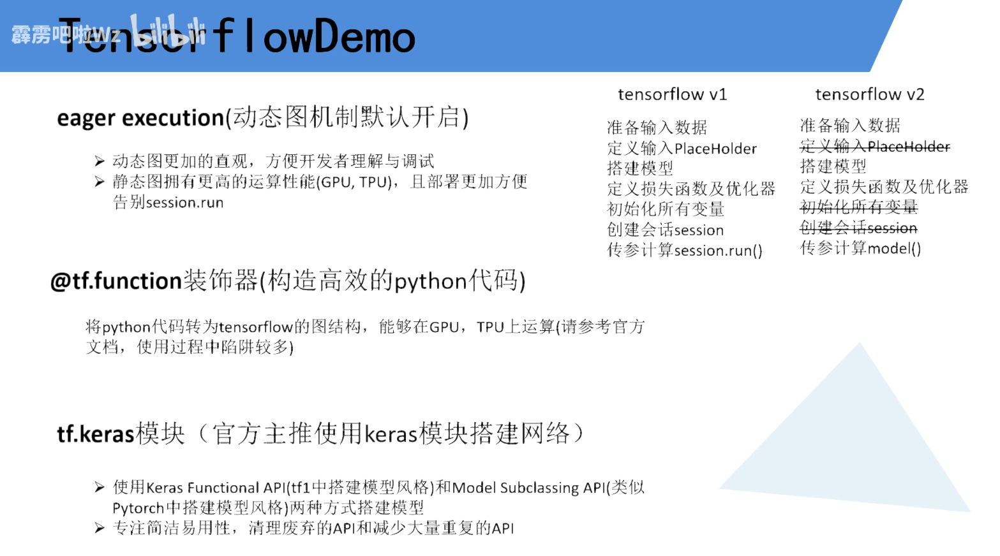

# TF2

- 动态图: 运行时实时查看值的变化
- 静态图: 模型搭建完后使用session.run才能看到数据




# 默认输入数据通道差别

- pytorch: [b, c, h ,w]

- tf: [b, h ,w, c]   可以修改为 [b, c, h, w]


# pytorch Conv2d参数

`nn.Conv2d(in_channels, out_channels, kernel_szie, stride, padding, padding_mode, dilation, gropus, bias)`

- in_channels:     int, in通道数
- out_channels:   int, out通道数
- kernel_size:      int, tuple, list 卷积核大小 推荐元组
- stride:             int, tuple, list 步长 推荐元组  default: (1, 1)
- padding:         int, tuple, list 填充               default: (0, 0) 
    - 1 代表上下左右各填充一行/一列的0
    - (1, 2) 代表上下各填充一行0, 左右各填充2行的0
- padding_mode: zeros / reflect / replicate / circular 填充模式 default: zeros 
- dilation:           int, 扩张卷积 default: 1
- groups:            int, 分组数量 default: 1
- bias:                bool, 偏置, 默认True


# Keras相同的api

- keras.Model            和 keras.models.Model

- keras.Sequential       和 keras.models.Sequential

- layers.Conv2D          和 layers.Convolution2D

- layers.MaxPool2D       和 layers.MaxPooling2D

- layers.AvgPool2D       和 layers.AveragePooling2D

- layers.GlobalAvgPool2D 和 layers.GlobalAveragePooling2D  pool + flatten 平均池化和展平

    layers.GlobalMaxPool2D 和 layers.GlobalMaxPooling2D      pool + flatten 最大池化和展平


# tf2 Conv2D参数

- filters:          out_channel
- kernel_size:   核心,整数或元组
- strides:         步长,整数
- padding=     "same" / "valid" 宽高不变或者不管
- activation=   "relu"
- dilation_rate: 整数
- groups:         整数
- data_format = 'channels_last' / 'channels_first'     调整输入图片 channel位置
    - channels_last:  [b, h, w, c]  默认
    - channels_first:  [b, c, h, w]
- kernel_initializer: 初始化器
- use_bias: 偏置 True / False(使用BN设置为False)
- name: 迁移学习时会用到

```python
CONV_KERNEL_INITIALIZER = {
    'class_name': 'VarianceScaling',
    'config': {
        'scale': 2.0,
        'mode': 'fan_out',
        'distribution': 'truncated_normal'
    }
}


# 后面顺序不对,字典赋值即可
layers.Conv2D(filters, kernel_size, strides, padding="same" / "valid", activation="relu", dilation_rate,  groups, data_format = 'channels_last' / 'channels_first', kernel_initializer=CONV_KERNEL_INITIALIZER) 

```


# layers.Sequential(Layers列表)

> Sequential 参数1可以放列表
>
> pytorch中则要 拆包 或者放入 OrderDict


# DW

> keras中有专门的DW卷积
>
> 不需要写维度

`layers.DepthwiseConv2D(kernel_size=3, padding='SAME', strides=stride, use_bias=False)`


# Reshape

> Reshape((1, 1, filters)) 输出的形状是 [b, 1, 1, filters]
>
> 它不会对batch进行影响,所以不用写batch

```python
class ChannelShuffle(layers.Layer):
    '''
    混淆通道
    '''
    def __init__(self, shape, groups: int = 2, **kwargs):
        super().__init__(**kwargs)
        batch_size, height, width, num_channels = shape
        assert num_channels % 2 == 0
        # 每个组合的通道个数
        channel_per_group = num_channels // groups

        # Tuple of integers, does not include the samples dimension (batch size).
        # [batch, height, width, channcels] => [height, width, groups, channel_per_group]
        self.reshape1 = layers.Reshape((height, width, groups, channel_per_group))

        # [height, width, groups, channel_per_group] => [batch, height, width, channcels]
        self.reshape2 = layers.Reshape((height, width, num_channels))

    def call(self, inputs, **kwargs):
        x = self.reshape1(inputs)
        # 最后两个维度顺序变化
        x = tf.transpose(x, perm=[0, 1, 2, 4, 3])
        x = self.reshape2(x)
        return x
```


# Add

> [b, h, w, c] + [b, h, w, c]
>
> 似乎是在 [h, w] 两个维度相乘

`x = layers.add([x, inputs])`

`layers.Add()([identity, x])`

> 更简单的写法

`x = tf.add(x, inputs)`


# Multiply

> [b, h, w, c] * [b, 1, 1, c]
>
> 似乎是在 [h, w] 两个维度相乘

`x = layers.Multiply()([inputs, x])`

> 也可以直接相乘

`inputs* x`

# tf.split

- inputs: 拆分的数据
- num_or_size_splits: 分为几份
- axis: 拆分维度

`b1, b2 = tf.split(inputs, num_or_size_splits=self.num_splits, axis=-1)`


# Concatenate(axis=-1) 拼接

- axis: 拼接维度,默认-1,就是channel

`x = layers.Concatenate(axis=1)([x1, x2])`


# reduce_mean 均值

`se_tensor = tf.**reduce_mean**(inputs, [1, 2], keepdims=True)`
